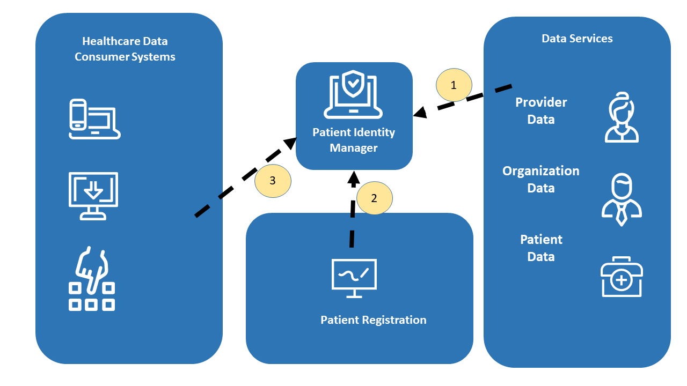

**[IHE IT Infrastructure](https://profiles.ihe.net/ITI)** **White Paper**

**Enabling Document Sharing Health Information Exchange Using IHE Profiles**

**CONTENTS**
* [1 Introduction](#1-introduction)
* [2 Principles of Health Document Sharing](#2-principles-of-ihe-for-health-document-sharing)
* [3 Document sharing profiles](#3-document-sharing-profiles)
* [4 Consuming data as FHIR Resources](#4-consuming-data-as-fhir-resources)
* [5 Patient identity management](#5-patient-identity-management)
* [6 Common Provider Directory](#6-common-provider-directory)
* [7 Security and Privacy](#7-security-and-privacy)
* [8 Further Reading](#8-further-reading)

**Comments on this whitepaper are invited at any time and can be submitted as either [IHE comment form](https://www.ihe.net/ITI_Public_Comments/) or [GitHub issues](https://github.com/IHE/HIE-Whitepaper/issues/new?template=public-comment-issue-template.md)** Please reference the section that your comment applies to.

# 1 Introduction

The [Integrating the Healthcare Enterprise (IHE)](http://www.ihe.net) standards profiling
organization has developed a [collection of profiles](http://profiles.ihe.net/ITI/TF/Volume1/index.html) which can be
leveraged for use by healthcare communities for the purposes of document
sharing. One of the most significant applications of healthcare
information technology is the exchange of health information among
disparate clinical information systems and otherwise unaffiliated care
providers. Across the world, various communities have developed or are
developing methods for exchanging health information among healthcare
providers, patients, and other authorized parties. The purpose of this
white paper is to provide an overview of the collection of IHE profiles
which are intended to be used by communities for exchanging health
information. The collection of profiles includes support for patient
identification, health document location and retrieval, provider
directories, and the protection of privacy and security. This white
paper will show how various profiles work together to provide a
standards based, interoperable approach to community and cross-community
health information sharing.

IHE has provided a recorded [YouTube webinar on the topic of the HIE-Whitepaper](https://www.youtube.com/watch?v=3sDgnS71m4o) with a focus on the FHIR support available.

## 1.1 Scope

Effective health information exchange involves a diverse set of
activities and a broad set of challenges, whether that exchange takes
place among affiliated or unaffiliated care providers. The IT
Infrastructure (ITI) domain of IHE has addressed many of these
challenges by defining a series of integration profiles to address
specific aspects of exchanging healthcare information. Each integration
profiles addresses part of the broad set of challenges involved in
health information exchange. The profiles, however, do not attempt to
address governance and policy choices that significantly affect how the
profile is adapted in any particular community. This white paper cannot
address all such governance and policy issues but will provide some
guidance on where governance and policy issues are applicable and offer
some common approaches.

It is very important to note that IHE focuses only on interoperability
and does not attempt to solve every issue involved in exchanging health
information. These solutions are meant to be plugged into an
architecture that is designed and executed by the exchange communities
themselves. Thus, while each community will generate an architecture
that meets its individual needs, the use of IHE profiles will lead to
the creation of standards-based communities.

This white paper will focus on explaining how IHE profiles are used to
address interoperability aspects of document sharing and how they work
together to solve common document sharing problems. The IHE White Paper
[Template for XDS Affinity Domain Deployment Planning](https://www.ihe.net/Technical_Framework/upload/IHE_ITI_White_Paper_XDS_Affinity_Domain_Template_TI_2008-12-02.pdf),
provides support for policy and deployment planning. The IHE “[Document
Sharing Metadata
Handbook](https://www.ihe.net/uploadedFiles/Documents/ITI/IHE_ITI_Handbook_Metadata.pdf)”,
provides guidance on developing policy and vocabulary valuesets for use
within the community. For application of Document Sharing for particular
clinical use cases, consider the work of the clinical IHE domains:
* Anatomic Pathology
* Cardiology
* Eye Care
* Laboratory
* Patient Care Coordination
* Patient Care Device
* Pharmacy
* Quality, Research and Public Health
* Radiation Oncology
* Radiology.

## 1.2 Intended Audience

The assumed audience for this white paper includes those involved in a
current or planned health information community of any size and scope
that needs an overview of a framework for building a health information
exchange model based on open standards. This paper does not cover the
technical details as they are found in the IHE Profiles, White Papers,
and Webinar material.

## 1.3 Overview of Health Document Sharing Communities

A health document sharing community (community) exists for the purpose
of increasing the accessibility of patient health information across
multiple organizations so that clinicians can make more informed
decisions about the care that they provide. Today, there are many
communities already in production and many more are being planned. The
size, nature and scope of communities vary widely but can be
characterized by a number of different aspects.

First, some communities are geographically focused while others are not.
What often comes to mind when speaking of a community is a regional
organization that facilitates information exchange across multiple
organizations that are relatively close in proximity. Major metropolitan
areas tend to be the focus of these communities, but often a regional
community encompasses several rural locales. On the opposite extreme of
the geographic aspect of communities is the network of United States
Veterans Hospitals. The VA (Veterans Administration) hospitals are
spread across the entire map of the US and beyond, yet significant
efforts have been spent on being able to exchange data among these
geographically separated care centers.

A second characteristic by which to categorize communities is the
organizational structure of the community. In some cases, the community
consists of a single hospital and several out-patient clinics that have
a referral relationship with the hospital. In other cases, a network of
competing hospitals, laboratories and private clinics may collaborate to
form a community.

A third means by which to describe communities is the scope of the
content shared. Some communities have very limited exchange
functionality. For instance, a community may focus entirely on
electronic lab result delivery or e-prescribing. Most communities define
a moderate scope to their exchange activities that might include results
delivery, electronic referrals, and perhaps some sharing of
encounter-based information (e.g., dictations). More advanced
communities leverage their network to include even larger scopes
(perhaps including the sharing of documents with the patient’s Personal
Health Record, exchange of clinical summaries, regional patient centric
workflows, etc.). No two communities are alike in terms of the set of
exchange activities that they facilitate.

Finally, a fourth aspect of a community is the size, scope and political
jurisdiction(s) that regulate it. The simplest community uses only an
ad-hoc arrangement to push documents from one organization to another.
National and sub-national jurisdictions have significant effects on the
organization and operations of a community.

Despite all the variance among communities, each has the same ultimate
goal: to increase the authorized exchange of patient health information
across organizations so that clinicians can make better decisions by being more informed about the longitudinal health history. This ultimate goal provides the reason
why the community exists, it is their affinity.

Once communities are formed there is a need to exchange health documents
across the communities as well as within them. IHE uses the concept of
cross-community to describe a federation of communities which use mostly
peer-to-peer interactions for the purposes of health document sharing. A
community may be a single organization, like the USA Veterans
Administration, a complex community of many organizations, or a more
simple organization like a single small hospital or facility.
Cross-community describes an environment where multiple communities, be
they simple, small, complex or large, interact without any understanding
of or access to the internal structure of any of the other participants.
A large federation of communities is exemplified by the multi-national
exchange “European Patients – Smart Open Service” (epSOS).

This paper will describe a set of building blocks for health document
sharing and each environment will use some set of those building blocks
to enable the architecture desired by the community or communities
participating.

# 2 Principles of IHE for Health Document Sharing

This section describes several principles which are foundational to
IHE’s approach to health document sharing.

## 2.1 General IHE principles

The following general IHE principles are applicable to the set of IHE
profiles used for Document Sharing:

  - IHE profiles describe the interactions between systems and not the
    implementation within systems. Interactions between systems are
    typically described by transactions which are technically specific
    and detailed enough to ensure interoperability among implementing
    systems. The internal implementation of the systems is not
    prescribed by IHE. For example, for patient demographic matching IHE
    specified the format of the query and response but not the algorithm
    or method used for the demographic matching. This allows freedom for
    implementations to address scalability, creative functionality,
    reliability, and other value-add.

  - IHE profiles are designed to support a wide variety of governance
    and policies. Because IHE supports adoption of its profiles around
    the world it is rarely possible to define policies that are
    applicable in all countries. For this reason, IHE profiles are
    designed with a variety of governance and policies in mind and are
    therefore applicable to a wide variety of environments. IHE profiles
    are designed to be policy neutral and support a broad set of
    governance; before they can be deployed there are many governance
    and policy issues that the communities must agree on. Examples of
    governance and policy issues are things like: roles and
    responsibilities, privacy, signature requirements, authorization,
    when to publish, what to publish, administrative roles,
    configuration, service level agreements, clinical pathways,
    long-term availability, etc.

  - IHE assumes there is a general understanding of widely implemented
    Information Technology Standards. IHE profiles typically leverage
    underlying technology like XML, TCP/IP, DNS, Digital Certificates 
	(PKI), etc. without detailed explanations.

## 2.2 Document Sharing Governance

IHE enables interoperable sharing of documents but assumes this sharing
occurs under a document sharing governance structure agreed to by all
parties involved. The governance structure addresses all policy issues
necessary to enable document sharing; content format and coding; and
other operational characteristics. The IHE profiles are designed to be
agnostic to governance and policy, while also being designed to support
and enforce those governance and policy choices. The governance may
apply only within a small group, such as a hospital and small
physician’s office, or may apply at a large level, like an entire
nation. In fact, sometimes temporary or informal governance (e.g., via
phone call) based on understanding of existing laws or customs is used
for exchange among participants. Typically, in order to allow for
effective and efficient interactions, the governance structure is
formalized through some legal mechanism. Overlapping governance is
common, where one set of agreements exist in the region and a different
set of agreements exist across the nation, yet most organizations will
eventually want to exchange documents regionally, nationally and
internationally.

In addition to general governance agreements, a document sharing
community should address the following issues:

  - **Format of document content**: To enable interoperable transfer of
    documents the receiving side must understand the format and
    structure generated by the sending side. Typically, there is an
    agreement on a set of document formats which must or may be
    supported. This could include unstructured content like PDF or text
    documents; or a more structured format like CDA or FHIR documents; or a specific
    implementation guide applied to CDA or FHIR document for a particular purpose. The
    key is to ensure that whatever type of content is shared, the
    receiving system is able to interpret the content in an appropriate
    way, either through human review or machine processing.

  - **Coding within documents**: Structured documents often include
    coded data derived from a given coding system. Agreeing on which
    coding systems to use for which data is often covered by an
    implementation guide for the structured document. Agreeing to an
    implementation guide, or a general guideline for coding systems to
    use, is necessary to enable semantic understanding of the document
    received.

  - **Coding of metadata**: Metadata are data that provide information
    about one or more aspects of the document. In the case of
    IHE-defined document exchange, specific metadata are coded within
    the structure of the content being exchanged. See 
	[2.6 Value of Metadata](#26-value-of-metadata) where the metadata defined by IHE are introduced. Some of that metadata
    have values chosen from a coding system defined by the governance of
    the sharing community. Because IHE profiles can be applied in many
    parts of the world where coding systems are different, IHE has not
    specified which code sets to use and this decision must be made
    among the systems exchanging documents.

The purpose of this aspect of governance is to enable semantic
interoperability among participating partners. When the Cross-enterprise
Document Sharing ([XDS](http://profiles.ihe.net/ITI/TF/Volume1/ch-10.html)) profile is used the governance is provided
through the [XDS](http://profiles.ihe.net/ITI/TF/Volume1/ch-10.html) Affinity Domain, see [3.2 Centralized Discovery and Retrieve](#32-centralized-discovery-and-retrieve).

## 2.3 Distinction between Documents and Messages

The HL7 standard for [Structured Documents
Section 1.2](http://archive.hl7.org/v3ballotarchive/v3ballot2008may/html/domains/uvcd/UVCD.htm#spec-dam)
describes the document vs. message distinction as follows “A document is
designed to be persistent for long periods of time, whereas messages are
more often expected to be transient. There is a place for both of these
constructs in healthcare.” HL7 characterizes a document by the following
properties:

  - *Persistence –* Documents are persistent over time. The content of
    the document does not change from one moment to another. A document
    represents information stored at a single instance in time.

  - *Wholeness -* A document is a whole unit of information. Parts of
    the document may be created or edited separately, or may also be
    authenticated or legally authenticated, but the entire document is
    still to be treated as a whole unit.

  - *Stewardship –*A document is maintained over its lifetime by a
    custodian, either an organization or a person entrusted with its
    care.

  - *Context* - A clinical document establishes the default context for
    its contents

  - *Potential for authentication* - A clinical document is an
    assemblage of information that is intended to be legally
    authenticated.

Health messages, on the other hand, are not expected to be persistent,
but represent a unit of information at a moment in time where the
context is often implied by the transaction partners. The content is not
always whole, where context may exist in the messaging environment
rather than inside the message itself. The distinction between message
and documents can get blurry at times, as messages sometimes can be
persisted and can contain all necessary context. In fact, messages can
be converted to documents and can carry documents within their content.
But documents are expected to be persistent, relevant over time and
having the same meaning regardless of environment. And messages need not
be any of those things.

 The scope of ‘document’ in Document
Sharing Profiles would prefer that documents have the above “Document”
properties, but does not require that documents have these properties.
The only property required is that there is a mime-type for the
document. 

### 2.3.1 FHIR-Document vs CDA-Document

Two structured and coded health specific document types are Clinical Document Architecture (CDA) and Fast Health Interoperability Resources (FHIR) documents. Both of these formats are defined by HL7. CDA has received much of the attention over the past 20 years, with FHIR emerging in 2010s. FHIR's initial focus was on an interactive query/response model referred to as "REST"; but FHIR has a "Document" encoding as well. The FHIR Document model has a top level resource that sets the context, content, and flow of the FHIR Document, and that is followed by copies of the data resources; all of this is encoded into a single bundle. This single bundle is able to be managed in Document Sharing just like any other Document. 

The FHIR Document has a benefit of being made up of the same resources that one would get from a Query/Response API. There is clear identity (.id) of each of these resources to so they are clearly distinct, which can be used for tracking if the data contained previously known. The FHIR Document model includes more consistent metadata and provenance for each resource. This traceability makes accessing the content within a FHIR Document more consistent limiting unnecessary duplication of data. This model enables more easy on the Content Consumer.

## 2.4 Longitudinal Patient Record

Building on the document concepts described above in [2.3 Distinction between Documents and Messages](#23-distinction-between-documents-and-messages) of
persistence, wholeness, stewardship and context, we can identify the
principle of the longitudinal patient record which is foundational and
central to health document sharing. Document Sharing Communities are
patient centric, and the patient identity is associated with every
document shared.

Care providers, which may support a broad variety of healthcare
facilities: private practice, nursing home, ambulatory clinic, acute
care in-patient facility, etc., are typically the sources or creators of
health documents. Typically, a patient will go through a sequence of
encounters in different care settings over the course of his/her lifetime.
With each encounter there is the potential that a provider will produce
a health document that can be shared with the community. Documents
shared by the provider and tracked by a [centralized registry](#32-centralized-discovery-and-retrieve) or [federation of communities](#3.3-federated-discovery-and-retrieve) form a
longitudinal record for the patients that received care among those
providers within the community. Longitudinal records, therefore, are
expected to last over the span of many decades, just as the documents
that comprise them are expected to have persistence, wholeness,
stewardship, context, and potential for authentication. As a health
information exchange is adopted it is a common practice to use an
historical bulk data load, or comprehensive patient summary to
initialize the electronic patient record with data for historical
purposes.

Within a care setting Clinical Data Repositories (CDR) or Clinical
Information Model Infrastructure databases might be used to enhance
Clinical Decision Support as a complement to document discovery. These
databases would not be nationwide, but rather be local to the patient’s 
care facility, like EHRs themselves, Document Sharing supports
interoperability amongst local systems and supports a longitudinal
patient record that spans across many local systems potentially using
multiple different database systems.

## 2.5 Use of Documents

IHE Document Sharing profiles are content neutral, meaning that any type
of information without regard to content and representation is
supported. A document is any collection of bytes, including proprietary
and textual formats. It is expected that a deployment of Document
Sharing will restrict the format and content of documents exchanged to
those agreed to by the [partners in the exchange](#22-document-sharing-governance). 
While the format and content of a document is not restrictively
defined, it is expected to be a coherent set of healthcare data that
includes enough context to be useful to a practitioner. A document
should have the [document characteristics](#23-distinction-between-documents-and-messages) namely,
persistence, wholeness, stewardship, context and potential for
authentication.

IHE Document Sharing profiles assume that a patient identity is
associated with every [document shared](#24-longitudinal-patient-record).

The most common document content standards that are profiled by IHE are HL7
Clinical Document Architecture (CDA), and HL7 FHIR Document. 
These standard formats supports the coding
of the clinical content which allows for use of the content both for
display purposes as well as machine processing. Although IHE encourages
the use of CDA or FHIR as the document content type of choice, it does not
restrict the content of a document in any way. Many times, a document
will be encoded in PDF or simple text (e.g., U.S. Department of Veterans
Affairs “Blue Button” program). Images and manifest documents may also
be exchanged using the same infrastructure. By defining a document so
liberally, IHE enables a common health record sharing infrastructure
that is flexible enough to handle the content types agreed to by the
partners in the exchange.

IHE and other organizations have integration profiles which define
document content for specific, commonly occurring cases. For example,
the IHE Laboratory domain has defined an XD-LAB content profile to
support sharing laboratory reports. Likewise, the IHE Patient Care
Coordination (PCC) domain has defined various content profiles including
a Medical Summary (XDS-MS) content profile and an Emergency Department
Referral (EDR) content profile. XDS-MS supports a patient’s transfer of
care from one care setting to another, and EDR supports the situation
where a physician determines that a patient should proceed directly to
an emergency department for care. In each of these cases, it is useful
for IHE to profile (define) both the transport and the content of the
documents so that true interoperability can more easily be achieved
throughout the healthcare continuum.

The IHE Content Profiles utilize two abstract actors “Content Creator”
and “Content Consumer”, utilizing an abstraction of “Share Content”;
where “Share Content” can be any of the Document Sharing infrastructures
including [MHDS](http://profiles.ihe.net/ITI/TF/Volume1/ch-50.html), [XDS](http://profiles.ihe.net/ITI/TF/Volume1/ch-10.html), [XDR](http://profiles.ihe.net/ITI/TF/Volume1/ch-15.html), [XCA](http://profiles.ihe.net/ITI/TF/Volume1/ch-18.html), etc.

**Figure 2.5-1: Document Sharing Actor Diagram**

IHE Content Profiles can be found:

  - CDA <https://wiki.ihe.net/index.php/Category:CDA>

  - FHIR-Document <https://wiki.ihe.net/index.php/Category:FHIR-Doc>
  
## 2.6 Value of Metadata

Another key principle leveraged by IHE Document Sharing is the use of
metadata. [Document metadata](#26-value-of-metadata) are data that provides
information about one or more aspects of the document. While a document
may be any collection of bytes, IHE defines a collection of metadata
about the document that aid its identity, discovery, routing, security,
provenance, privacy, authenticity and electronic pre-processing. The set
of metadata is defined to facilitate interoperability, so that
receiving systems can manage, route and administer documents even if
they are unable to interpret the contents of the document. The metadata
are defined in such a way that additional metadata, defined outside of
IHE, can be sent. Of course, systems not enabled to understand the
additional metadata will ignore them, but this capability allows the set
of metadata defined by IHE, which is already extensive and robust, to be
extended when local needs arise.

Metadata serve multiple purposes. They allow systems to perform:

  - automated management of the documents – like assigning priorities or
    work tasks

  - automated patient identification – adding the new information to the
    correct patient’s local record

  - support for provenance management – making decisions based on
    authority of creator of content

  - support for episodic searches – by type, date of service

  - support relationships between documents

  - support privacy/authorization controls – enabling access to content
    only where appropriate

  - support security and integrity controls

Any metadata element may support overlapping purposes, but the
combination of metadata elements provides a robust understanding of the
document and enables automated and manual management of the document
without the requirement access to the detailed clinical information
contained within the document.

## 2.7 Document Relationships

The metadata defined in the IHE Document Sharing model encompasses more
than just characteristics of documents. In fact, the metadata model is
very rich, encompassing the relationships between documents through use
of folders, submission sets, and associations.  For a complete list of
document metadata, refer to [ITI TF-3:
Section 4.1 Abstract Metadata Model](http://profiles.ihe.net/ITI/TF/Volume3/ch-4.1.html). This abstract metadata model has two representations: [Section 4.2 ebRIM Representation](http://profiles.ihe.net/ITI/TF/Volume3/ch-4.2.html) used by [XDS](http://profiles.ihe.net/ITI/TF/Volume1/ch-10.html) and [XCA](http://profiles.ihe.net/ITI/TF/Volume1/ch-18.html);
and [Section 4.5 FHIR Representation](http://profiles.ihe.net/ITI/TF/Volume3/ch-4.5.html) used by [MHDS](http://profiles.ihe.net/ITI/TF/Volume1/ch-50.html) and [MHD](http://profiles.ihe.net/ITI/TF/Volume1/ch-33.html).

**Documents:** Each document shared using IHE-defined constructs comes
with a collection of metadata which describes the document. The metadata
describing the document includes things like: document identifier,
patient identifier and demographics, document author, class of document,
confidentiality of document, creation time, and events causing creation
of document, document format and several more. 

**Folders:** Metadata shared using IHE-defined constructs can also
describe folders and document’s membership in folders. A folder may be
used to collect documents for many purposes, like ease of access or
describing a functional purpose.

**Submission Set:** When documents are published or pushed using IHE
transactions they are collected into submission sets to reflect the
collection of documents sent at a given moment. Since a submission set
reflects a collection of documents it shares some of the same metadata
as a document, like patient identifier and author, and adds metadata
reflecting the collection like identifier of the source, intended
recipient and submission time.

**Document Associations:** The document sharing metadata supports the
description of associations between documents. The associations
supported are: append, replace, transform, transform with replace, and
signs (i.e., digital signature). The append, replace, and transform
associations support representation of document lifecycle events, where
a document is associated with documents which are created as part of
lifecycle events related to the original document.

**Figure 2.7-1: Multiple Document formats of the same document related by Document Associations.**

Depicted in Figure 2.7-1 is a master document of format C-CDA with a set of transforms of the same content into CCD, C32, PDF, and a FHIR Document. This enables a Document Consumer to pull the content that best fits their ability to consume. Note the master document could be of any format, so one might chose to have the master document as the FHIR Document. Similar associations functionality would also support human language translations.

## 2.8 Document Sharing Models

IHE has enabled three distinct Document Sharing Models that share the
principles in this section. Because the principles are the same it is
relatively simple to implement more than one model to accomplish
multiple objectives. The three models are:

  - **Direct Push** – in this model, clinical content in the form of
    documents and metadata is sent directly to a known recipient, or
    published on media for delivery

  - **Centralized Discovery and Retrieve** – in this model, a centralized
    locator is used to discover the location of documents which enables
    a retrieval of the document from a custodian who has registered
    existence of the document with the centralized locator

  - **Federated Discovery and Retrieve** – in this model, a collection of
    peer entities are enabled to query each other to locate documents of
    interest, followed by retrieval of specific documents.

These models share the common definition of a document and metadata
describing documents, folders, submission sets and document
associations. Each requires some level of governance structure in order
to operate, although there is some difference in the governance needs.
For instance, the centralized model requires knowledge only of the
centralized locator which can then provide connections with distributed
document repositories. For Direct Push and Federated approaches a
detailed directory of participating entitles is typically used to ensure
that the push or query transactions are sent to the proper place. All
include strong support for authenticity and encryption on transport.
Privacy requirements vary especially between the Direct Push, where
privacy policy is generally determined prior to initiation of the
action, and Discovery mechanisms where privacy policy is most often
determined prior to responding to the request. So, while the issues that
need to be resolved through governance are largely the same, the
resolutions will sometimes vary depending on the model chosen.

It is expected that most communities of exchange will start with one of
the three forms of document exchange and, if needed, adopt the others
later. The addition of a new model to an existing deployment is
relatively simple because the IHE profiles are based on common
principles.

## 2.9 Patient Identity Management

The Document Sharing mechanisms enabled through IHE assume that a
patient is associated with every document shared. That patient is
described within the metadata describing the document.

In the case of a Direct Push, it is up to the receiving entity to
resolve the patient by using the metadata containing identifiers and
demographics of the patient. It is preferable to resolve the patient
prior to sending documents and using the patient identifier metadata
element to unambiguously communicate the patient’s identity.

In the Discovery models the document query requires the specification of
a patient identifier as known by the query recipient. So, in these
models it is necessary to resolve the patient prior to searching for
documents. In fact, the query does not carry any patient demographic
data beyond the patient identifier.

Resolving the patient is a complex subject made more complex through
historic norms, regulations, and business factors. Some regions have a
universal identifier, but most regions do not. IHE provides several
profiles that aid the resolution of the patient identifier. 

## 2.10 Locating sharing partners

One of the challenges of Document Sharing that is not directly addressed
by IHE is the identification of Document Sharing partners. Each Document
Sharing model has a different type of need: where a centralized
discovery approach requires the identification of the central locater,
the peer-based push and discovery mode requires identification of each
of the peers. This ability to discover sharing partners can be
accomplished in many different ways and a clear preference is not yet
apparent. The approaches can be broadly characterized as a) locating
electronic services which can provide information and b) locating
patient specific source of information.

For locating electronic services which can provide information, some
approaches currently used in various parts of the world are:

  - Local configuration files – many organizations keep a local
    configuration file or address book which is managed manually
    whenever a new sharing partner is identified or updated.

  - Service Registry – a services registry is sometimes used as a
    centralized service available to all participants.

  - Healthcare Provider Directory profiles – 
    enables a directory of individual and organizational entities along
    with electronic services provided by those entities. See [6 Common Provider Directory](#6-common-provider-directory).

For locating source of information about a particular patient, some
approaches are:

  - Patient Specific Health Data Locator – the Cross-Community Patient
    Discovery ([XCPD](http://profiles.ihe.net/ITI/TF/Volume1/ch-27.html)) profile enables a special type of locator which can
    be used to find entities holding data about specific patients. See
    [5 Patient identity management](#5-patient-identity-management) for more information about [XCPD](http://profiles.ihe.net/ITI/TF/Volume1/ch-27.html).

  - Patient Identity Cross-Reference ([PIX](http://profiles.ihe.net/ITI/TF/Volume1/ch-5.html)) – may be used to find an
    assigning authority of an organization which has registered patient
    demographics for the patient.

  - Patient Demographic Query ([PDQ](http://profiles.ihe.net/ITI/TF/Volume1/ch-8.html)) – may be used to find an assigning
    authority of an organization which has registered patient
    demographics for the patient.

  - Cross-Enterprise Document Sharing ([XDS](http://profiles.ihe.net/ITI/TF/Volume1/ch-10.html)) – used to locate documents
    related to a specific patient, see [Section 3.2](#32-centralized-discovery-and-retrieve).

## 2.11 Security/Privacy

IHE addresses Privacy and Security through the use of Risk Assessment
and Management. Each profile is assessed for various types of risks and
the profile includes mitigations identified through that assessment in
the privacy and security considerations.

IHE includes profiles specific to interoperability of security and
privacy. Interoperability profiles are not enough to fully address
privacy or security. Privacy and security are enabled and enforced at
many levels of depth including policy, physical environment, procedures,
organizational, departmental, functional, and information technology.

IHE provides profiles that support privacy and security audit logging,
user and system identification and authentication, access control,
encryption, data integrity, digital signatures, and privacy consent
management. Security and Privacy and the profiles IHE offers are
discussed in [7 Security and Privacy](#7-security-and-privacy).

# 2.12 Dynamic Documents

There are three different models of a document: Stable, Delayed Assembly, and On-Demand. 

A **Stable document** is one where the content has been gathered together at the time the document entry is authored. The stable model fits best with environments that can produce a document and have it stored in a Document Repository for retrieval as is necessary. The Stable document entry can be replaced, but the content is fixed at the time the document entry is authored.

A **Delayed Assembly document** is one where a Document Source (or Document Source Repository) publishes a promise to produce a document of a specific kind and identity. The document is not assembled until the first Document Consumer requests to retrieve that document. The retrieve request triggers the creation (delayed assembly) of the document. The Document Entry is updated with the given hash and size, and the document is now available as a Stable document. This model can be used when the Document Source is a database that is not inherently document based, but can produce a document for persistant storage upon request. The Document Source can indicate all of the metadata about the document (except the hash and size), but chooses to not produce the document content until a retrieve request is made. 

An **On-Demand document** is one where a Document Source (or Document Source Repository) publishes a promise to produce a document of a specific kind, but content that is expected to change over time. The On-Demand model is used when the document source can ensure that the returned document always contains information that is known to be accurate at the time of request. This can be used in cases where the document source is a database that is not inherently document based, and document consumers wish to always receive the most up to date information available. Thus, a request two months apart may contain different content given changes during the two month span. The document instance isn't created until a Document Consumer requests to retrieve an instance of the document. The retrieve request triggers the creation of an instance of the document. The instance could be preserved as a snapshot, which is a kind of [Association](#27-document-relationships) managed off of the On-Demand document entry.

# 3 Document sharing profiles

The key actors in health information exchange are the document source
actors – those applications or modules that create the document to be
shared, and the document consumer actors – those applications or modules
that retrieve the document to act on it (i.e., present it to the user,
import it into the receiving system, etc.). The strength of the Document
Sharing profiles is that they enable effective sharing of data among
multiple, disparate systems in a way that minimizes the burden that data
sharing imposes on those systems. These profiles may be categorized
according to three different data sharing models:

  - Direct Push – supports **point-to-point push of documents** where
    content is sent directly to the intended recipient found through
    manual means or infrastructure enabled directory

  - Centralized Discovery and Retrieve ([XDS](http://profiles.ihe.net/ITI/TF/Volume1/ch-10.html) Affinity Domain) – a
    community of sharing partners agrees to use a common infrastructure
    to enable Health Document Sharing. A **document source will publish**
    the existence of documents to a location that is accessible to other
    systems. Then, document consumers can discover document locations
    that have been previously published and pull a copy of the
    document.

  - Federated Discovery and Retrieve – content is pulled directly from
    the content holder who is found through manual means or a directory

The three models are designed to support different use cases. The Direct
Push model can be relatively simple but it cannot satisfy all use cases
because it relies on the source of documents to know where those
documents will be needed. The Discovery models can also handle use cases
like:

  - Treatment of a new condition where prior conditions may be relevant

  - Open Referral, where the patient is allowed to choose the specialist

  - Highly mobile patient

  - Emergency

  - Patient with many medical conditions

  - Patient with complex condition

The IHE profiles addressing these models are:

  - Direct Push – Mobile access to Health Documents ([MHD](http://profiles.ihe.net/ITI/TF/Volume1/ch-33.html)), Cross-Enterprise Document Reliable Interchange ([XDR](http://profiles.ihe.net/ITI/TF/Volume1/ch-15.html)), and Cross-Enterprise Document Media Interchange ([XDM](http://profiles.ihe.net/ITI/TF/Volume1/ch-16.html))

  - Centralized Discovery and Retrieve – Mobile access to Health Documents ([MHD](http://profiles.ihe.net/ITI/TF/Volume1/ch-33.html)), Mobile Health Document Sharing ([MHDS](http://profiles.ihe.net/ITI/TF/Volume1/ch-50.html)), and Cross-Enterprise Document Sharing ([XDS](http://profiles.ihe.net/ITI/TF/Volume1/ch-10.html))

  - Federated Discovery and Retrieve – Cross-Community Access ([XCA](http://profiles.ihe.net/ITI/TF/Volume1/ch-18.html))

The following figures show the flow of data for each of these models.

**Figure 3-1: Data Flow for Direct Push Sharing Models.**

Figure 3-1 shows three different Direct Push models. The sending system is depicted on the left sending to a recipient on the right. 

**Figure 3-2: Data Flow for Centralized Discovery and Retrieve Sharing Models.**

Figure 3-2 shows a MHDS community, and a XDS community;  with clients publishing on the left side and clients consuming on the right side. Note that MHD clients are shown with the ability to be accessing the XDS Affinity Domain using the MHD API. This figure is showing the relationship of the profiles and actors, but is not depicting all possible deployment architectures.

**Figure 3-3: Data Flow for Federalization Discovery and Retrieve Sharing Models.**

Figure 3-3 shows a deployment depicting set of communities that are linked by the [XCPD](http://profiles.ihe.net/ITI/TF/Volume1/ch-27.html) for patient discovery, and [XCA](http://profiles.ihe.net/ITI/TF/Volume1/ch-18.html) for federated Query for Documents and Retrieve Documents. On the Left side are [XDS](http://profiles.ihe.net/ITI/TF/Volume1/ch-10.html) and [MHD](http://profiles.ihe.net/ITI/TF/Volume1/ch-33.html) style clients. In this case the Publication functionality is supported as they are interacting locally with an XDS Affinity Domain.

The following sections will describe in more detail the three models.

## 3.1 Direct Push

### 3.1.1 Cross-Enterprise Document Reliable Interchange (XDR)

The [XDR](http://profiles.ihe.net/ITI/TF/Volume1/ch-15.html) profile provides a point-to-point method of sending documents to
a specific recipient. It leverages common principles as described in
Section 2. It sends documents and metadata using the same Web-Services
reliable transport that is used to publish documents in the Centralized
Discovery and Retrieve Document model.

The typical use case for [XDR](http://profiles.ihe.net/ITI/TF/Volume1/ch-15.html) is the patient referral. Dr. Suwati may
wish to refer her patient Mary to a specialist, Dr. Lima, who works
across town. [XDR](http://profiles.ihe.net/ITI/TF/Volume1/ch-15.html) may be used to send the referral document (and possibly
other clinical documents) from Dr. Suwati's Apollo EMR to Dr. Lima's
Great Charts EMR.

The [Point-to-Point Transmission of Documents slide deck](https://github.com/IHE/IT-Infrastructure/blob/master/Presentations/IHE-XDM_XDR_2012-12-10.ppt) provides more detail about [XDR](http://profiles.ihe.net/ITI/TF/Volume1/ch-15.html).

### 3.1.2 Cross-Enterprise Document Media Interchange (XDM)

The Cross-Enterprise Document Media Interchange ([XDM](http://profiles.ihe.net/ITI/TF/Volume1/ch-16.html)) profile addresses
situations where the electronic exchange of clinical information does
not rely on networked connections between the parties exchanging the
information. In these cases, electronic media (such as CDs and USB
drives) or email may be employed to transport the data from one system
to another.

The [XDM](http://profiles.ihe.net/ITI/TF/Volume1/ch-16.html) e-Mail option is a logical advance for directed e-mail exchange
that provides content packaging and metadata to enable accurate
processing. The [XDM](http://profiles.ihe.net/ITI/TF/Volume1/ch-16.html) profile has been adopted in national exchange
specifications such as the USA defined “Direct Project”.

The [XDM](http://profiles.ihe.net/ITI/TF/Volume1/ch-16.html) CD-ROM and USB-Memory options are logical methods for physically
handing the patient records to the patient them-selves; or for delivery
via secure courier.

Whether the data is transferred via electronic media or e-mail, the same
format is used to express the documents, metadata, and encapsulation
structure. The [XDM](http://profiles.ihe.net/ITI/TF/Volume1/ch-16.html) profile can be especially useful when there is no
established infrastructure in place between those who have documents and
those that need them. Thus the [XDM](http://profiles.ihe.net/ITI/TF/Volume1/ch-16.html) profile can be used in environments
where much of the Governance is managed manually, out-of-band. The
receiver of an [XDM](http://profiles.ihe.net/ITI/TF/Volume1/ch-16.html) exchange does need to be robust to high variability
of the content due to this lack of automated Governance.

Again, the patient referral use case is a typical one that may employ
[XDM](http://profiles.ihe.net/ITI/TF/Volume1/ch-16.html). Dr. Suwati may wish to refer her patient Mary to an orthopedist who
does not have an electronic endpoint to receive the referral
documentation or to an orthopedist of Mary’s choice in which case the
point of service is unknown at the time of the referral. Dr. Suwati
decides to write a referral letter and to create an image file of the
X-ray of Mary's leg. Dr. Suwati employs her EMR to write this letter and
the image file to a USB key using the [XDM](http://profiles.ihe.net/ITI/TF/Volume1/ch-16.html) profile. She then gives the
USB key to Mary so that she may take the files with her to the
orthopedist.

The [Point-to-Point Transmission of Documents slide deck](https://github.com/IHE/IT-Infrastructure/blob/master/Presentations/IHE-XDM_XDR_2012-12-10.ppt)  provides more detail about [XDM](http://profiles.ihe.net/ITI/TF/Volume1/ch-16.html).

### 3.1.3 Mobile access to Health Documents (MHD) push

The [MHD](http://profiles.ihe.net/ITI/TF/Volume1/ch-33.html) profile provides a point-to-point method of sending documents to a specific recipient. It leverages common principles described in Section 2. It sends documents and metadata using FHIR Rest push to deliver one or more documents to a Document Recipient. 

The typical use case for [MHD](http://profiles.ihe.net/ITI/TF/Volume1/ch-33.html) in this mode is when documents are known to be needed by a recipient. Such as a patient referral in the use case given in [XDR](#311-cross-enterprise-document-reliable-interchange-xdr).

In addition the [MHD](http://profiles.ihe.net/ITI/TF/Volume1/ch-33.html) can be used as an API in push mode. In this use case the [MHD](http://profiles.ihe.net/ITI/TF/Volume1/ch-33.html) push request could be handled by an intermediary that further pushes the content using [XDR](http://profiles.ihe.net/ITI/TF/Volume1/ch-15.html) or [XDM](http://profiles.ihe.net/ITI/TF/Volume1/ch-16.html). On the recipient side the [MHD](http://profiles.ihe.net/ITI/TF/Volume1/ch-33.html) api could be used by an intermediary to forward a [XDR](http://profiles.ihe.net/ITI/TF/Volume1/ch-15.html) or [XDM](http://profiles.ihe.net/ITI/TF/Volume1/ch-16.html) push is further pushed to a Recipient using [MHD](http://profiles.ihe.net/ITI/TF/Volume1/ch-33.html); or the intermediary could store in a registry allowing a [MHD](http://profiles.ihe.net/ITI/TF/Volume1/ch-33.html) Document Consumer to query and retrieve the content.

## 3.2 Centralized Discovery and Retrieve

The Mobile Health Document Sharing ([MHDS](http://profiles.ihe.net/ITI/TF/Volume1/ch-50.html)) and Cross-Enterprise Document Sharing ([XDS](http://profiles.ihe.net/ITI/TF/Volume1/ch-10.html)) profile enables centralized
discovery of health documents and retrieval of those documents from
distributed document repositories. Mobile access to Health Documents ([MHD](http://profiles.ihe.net/ITI/TF/Volume1/ch-33.html)) provides a simplified API for Document Source and Document Consumer actors.

The following scenario describes a typical exchange of clinical
information using [XDS](http://profiles.ihe.net/ITI/TF/Volume1/ch-10.html) or [MHDS](http://profiles.ihe.net/ITI/TF/Volume1/ch-50.html). Dr. Suwati works for New Hope Medical Partners
which provides her with an EMR system. Her patient, Mary Gomez, just
explained to the doctor that she was recently hospitalized at Norwalk
General Hospital. Dr. Suwati would like to review the medical records
that documented Mary's hospital stay. Using her EMR, Dr. Suwati searches
for recent documents for Mary Gomez created by Norwalk General
Hospital's EHR. Having found several documents (lab results, radiology
reports, a discharge summary, etc.), Dr. Suwati chooses first to view
Mary's radiology reports. Having read the reports, she discards them.
However, Dr. Suwati reads the discharge summary and then saves it to
Mary's record in the local EMR.

In this scenario of health information exchange, the primary player (Dr.
Suwati) has three principal objectives: find patient records available
from external systems, view a selection of those records, and
incorporate a select number of those records to her local system. This
sequence of actions is repeated continually in the healthcare setting.
To address this very common scenario, IHE has created the [MHDS](http://profiles.ihe.net/ITI/TF/Volume1/ch-50.html) profile and [XDS](http://profiles.ihe.net/ITI/TF/Volume1/ch-10.html) profile, a
method to coordinate the authorized discovery and sharing of medical
documents among disparate information systems.

[XDS](http://profiles.ihe.net/ITI/TF/Volume1/ch-10.html) minimizes the burden imposed on the document sources
when sharing documents by establishing the use of two infrastructure
components (the document registry and document repositories), which
handle most of the effort involved in exchanging clinical data. This
separation allows for minimal yet rich metadata to be centrally managed
in a document registry while the full clinical details stay protected
within distributed document repositories. 

[MHDS](http://profiles.ihe.net/ITI/TF/Volume1/ch-50.html) allows for a similar separation of repository, but does not call out the repository actor. The MHD Document Source simply preserves the document in an appropriate repository available to the MHDS community, and records the URL to that location when publishing the metadata to the MHDS repository. The MHD Document Source can include the document within the publication request where the MHDS Registry will store and provide access to it centrally. MHDS also includes solutions for Patient Identity Management Registry ([PMIR](http://profiles.ihe.net/ITI/TF/Volume1/ch-49.html)), Terminology Services ([SVCM](http://profiles.ihe.net/ITI/TF/Volume1/ch-51.html)), organization directory ([mCSD](http://profiles.ihe.net/ITI/TF/Volume1/ch-46.html)), user authentication/authorization ([IUA](http://profiles.ihe.net/ITI/TF/Volume1/ch-34.html)), system security ([ATNA](http://profiles.ihe.net/ITI/TF/Volume1/ch-9.html)), and Consistent Time ([CT](http://profiles.ihe.net/ITI/TF/Volume1/ch-7.html)).  More details available in the [MHDS](http://profiles.ihe.net/ITI/TF/Volume1/ch-50.html) profile.
 
Both XDS and MHDS enable the automation of discovery and retrieve of document content by more advanced health information systems.

The following Figure 3.2-1 shows the use of the MHD profile as an API to an XDS Document Sharing exchange. 

**Figure 3.2-1: XDS environment with MHD as API.**

IHE Youtube channel has more [XDS webinar](https://www.youtube.com/watch?v=VG1oF5FEijY&t=2s) and [MHD webinar](https://www.youtube.com/watch?v=ZpQrHI3VVxY&t=1s) available.

### 3.2.1 Document Publishing

The document registry and document repositories always work
hand-in-hand, the one being useless without the other. It may be
convenient to think of the document registry and document repositories
like a public library. The document repositories are a library's set of
shelves, an organized resting place for books (i.e., medical documents)
that are available to library patrons. The document registry is the
library's card-catalog, a tool for locating specific books that lie on
those rows and rows of shelves. Unlike a library, the bookshelves are
potentially deployed within each participating organization; thus the
books are controlled by the original organization until the moment that
another organization requests a copy.

It is the responsibility of the publisher to put the books (documents)
on the shelf and provide the information for the card-catalog
(metadata). The library will step in to update the card-catalog with the
data needed to find the new book. In IHE jargon the publisher is called
the document source, whereas the act of putting the book on the shelf
and then cataloging it is referred to as "provide and register." Thus,
the document source sends a copy of medical documents and associated
metadata to the document repository, and the document repository
subsequently sends the metadata to the document registry (see Figure
3.2.1-1).

**Figure 3.2.1-1: Provide and Register Document**

The actual location of the document repository will depend on the local
deployment. IHE provides flexibility to enable many different deployment
approaches.

  - The document repository may be combined with the document registry,
    allowing for an integrated environment where no external “update
    registry” transaction is needed.

  - The document repository could be combined with a document source
    allowing a large hospital system to enable its local EMR system to
    also act as a document repository. In this case, there is no
    externally recognized “provide and register” transaction, but simply
    the “update registry” transaction from the hospital system to the
    central document registry.

  - There is no restriction on how many document repositories can be
    associated with a single document registry. However, any document
    repository must be made available for authorized retrieval of the
    documents contained and referenced within the Document Registry.

  - There are no constraints on where a document repository is hosted,
    the decision is based on many implementation considerations. For
    instance, a hospital may want to keep its clinical content local in
    which case it supplies a repository hosted locally. Or a small
    physician office may have no ability to support a repository and
    will prefer to use a repository provided by an external
    organization, like a hospital system of an infrastructure only
    partner.

### 3.2.2 Document Discovery

To complete our analogy, we must consider the library patron (Dr. Suwati
in our case), whose goal is to find specific books. The patron interacts
with the catalog; sometimes searching for specific books, other times
browsing what is available. Once the locations of interesting books are
discovered, the patron fetches them from the shelves. In our Document Sharing drama,
the document consumer (our library patron) interacts with the Document
Registry to find medical records of interest. This process is known as
the query for documents. The act of fetching the medical record
from a document repository is known as the retrieve document. 
Of course with the structured and coded metadata, this step
of discovery can be highly automated.

### 3.2.3 Governance

As described in [1 Principles of Health Document Sharing](#1-principles-of-health-document-sharing), 
Document Sharing is document content neutral; uses
document metadata that are represented in a structured, standard format;
and supports longevity of document storage.

[MHD](http://profiles.ihe.net/ITI/TF/Volume1/ch-33.html) and [XDS](http://profiles.ihe.net/ITI/TF/Volume1/ch-10.html) requires a [governance structure](#22-document-sharing-governance) and
defines the [XDS](http://profiles.ihe.net/ITI/TF/Volume1/ch-10.html) Affinity Domain or a Community as the agent for that governance. An [XDS](http://profiles.ihe.net/ITI/TF/Volume1/ch-10.html)
Affinity domain or a Community is a group that have agreed to
work together using a common set of policies and Document Sharing. Some examples
are:

  - Regional community of care

  - Nationwide Electronic Health Record (EHR)
  
  - Personal Health Record (PHR) applications and services

  - Specialist (cardiology, oncology) or disease-oriented (diabetes)
    care networks

  - Government-sponsored or federation of enterprises

  - Insurance provider supported communities

Document Sharing is patient centric thus requires that a Patient Identity 
Domain coordinates use of a single Patient Identification. 
In [XDS](http://profiles.ihe.net/ITI/TF/Volume1/ch-10.html) Domain called this is called an [XDS](http://profiles.ihe.net/ITI/TF/Volume1/ch-10.html) Affinity
Domain Patient Identification Domain (XAD-PID). A XAD-PID is a patient
identifier assigning authority which provides a single unique identifier
for each patient for which documents are registered in the document
registry. This ensures that, for example, when submitting documents for
Mary Gomez the same unique patient identifier is associated with each
document for Mary Gomez, and thus a search can reliably find all of
Mary’s documents by using this single unique identifier. 

There are various methods defined by IHE to support [Patient Identity Management](#5-patient-identity-management).

Further detail regarding deployment of an [XDS](http://profiles.ihe.net/ITI/TF/Volume1/ch-10.html) Affinity Domain may be
found in the [Template for XDS Affinity Domain Deployment Planning IHE ITI White Paper](https://www.ihe.net/Technical_Framework/upload/IHE_ITI_White_Paper_XDS_Affinity_Domain_Template_TI_2008-12-02.pdf).

Document Sharing is commonly deployed in an integrated environment which makes use of
many IHE profiles working together to enable all aspects of a Document
Sharing environment. The services include:

  - [5 Patient Identification Management](#5-patient-identity-management).

  - [3.2.4 Notifications and Subscriptions](#324-notifications) 

  - [7 Security and Privacy](#7-security-and-privacy) Profiles like ATNA, CT, XUA, BPPC and others.

### 3.2.4 Notifications

The [XDS](http://profiles.ihe.net/ITI/TF/Volume1/ch-10.html) profile supports registration of content and the ability to
query and retrieve from a centralized service, but there are many use
cases where a system (i.e., a clinician) may wish to be proactively
notified when a new document is made available. DSUB describes the use of subscription and notification mechanisms for use within an XDS Affinity Domain and across communities. The subscription allows for the matching of metadata during the publication of a new document for a given patient, and results a notification which can be parsed:

1. Using a push-style method of notification where the Subscriber subscribes to receive notifications about the availability of documents based on specific criteria or,
2. Using a pull-style method which creates a Pull Point resource able to store notifications targeted to a specific recipient. Notifications stored in the Pull Point can be retrieved using a specific transaction.

The [Publication and Discovery slide deck](https://github.com/IHE/IT-Infrastructure/blob/master/Presentations/IHE-XDS_DSUB_2012-12-10.ppt) provides more detail about [XDS](http://profiles.ihe.net/ITI/TF/Volume1/ch-10.html) and [DSUB](http://profiles.ihe.net/ITI/TF/Volume1/ch-26.html).

## 3.3 Federated Discovery and Retrieve

A community, such as an [XDS](http://profiles.ihe.net/ITI/TF/Volume1/ch-10.html) Affinity Domain, is a means for a specific
set of related organizations/facilities to exchange clinical
information. But care-givers need access to a patient's entire
longitudinal health history, regardless of where that historic
information was created. The population is mobile, sometimes due to a
temporary situation like a vacation, reoccurring like seasonal housing,
work related, or some other choice. Therefor many patients receive care
outside of their home community and sometimes the care received
externally can be very significant clinically. A very specific
healthcare related use-case is when a patient is seeking the care of a
specialist. So, there is a need to share health information between two
communities. The Cross-Community Access ([XCA](http://profiles.ihe.net/ITI/TF/Volume1/ch-18.html)) profile was developed to
address this need.

To implement [XCA](http://profiles.ihe.net/ITI/TF/Volume1/ch-18.html), a community builds two services called gateways
through which all inter-community transactions will flow. An Initiating
Gateway is used to send queries to other communities, while a Responding
Gateway is employed to receive queries and respond to them. Behind the
gateways may be a single organization, like the USA Veterans
Administration, a complex community of many organizations, or a more
simple organization like a single small hospital or facility. The
gateways hide the internal structure of each participant in the
cross-community exchange.

[XCA](http://profiles.ihe.net/ITI/TF/Volume1/ch-18.html) is based on the discovery and retrieve pattern defined in [XDS](http://profiles.ihe.net/ITI/TF/Volume1/ch-10.html), but
does not require that either community use [XDS](http://profiles.ihe.net/ITI/TF/Volume1/ch-10.html). Rather than the
centralized model of [XDS](http://profiles.ihe.net/ITI/TF/Volume1/ch-10.html), which aids locating documents of interest, the
[XCA](http://profiles.ihe.net/ITI/TF/Volume1/ch-18.html) model enables a federated approach, where discovery of documents of
interest requires a query to each community that might hold such
documents. The [XCA](http://profiles.ihe.net/ITI/TF/Volume1/ch-18.html) gateways are the conduit through which these
transactions flow.

The extension of [XCA](http://profiles.ihe.net/ITI/TF/Volume1/ch-18.html) beyond [XDS](http://profiles.ihe.net/ITI/TF/Volume1/ch-10.html) based communities is an important
characteristic. A community that is not [XDS](http://profiles.ihe.net/ITI/TF/Volume1/ch-10.html) based, such as the
aforementioned USA Veterans Administration, can develop services that
implement the interface characteristics of [XCA](http://profiles.ihe.net/ITI/TF/Volume1/ch-18.html) Initiating and Responding
Gateways. Since [XCA](http://profiles.ihe.net/ITI/TF/Volume1/ch-18.html) defines only the interface characteristics,
proprietary networks are able to support Document Sharing without
changing their internal architecture.

The Federation aspects of [XCA](http://profiles.ihe.net/ITI/TF/Volume1/ch-18.html) allow for easy expansion of a network to
add new gateway participants in a way that has minimal impact on the
creators of content, which still publish information locally, and those
that need the data, which use the same query mechanism no matter how
broadly the query is federated.

The Federation of many communities does create a larger patient identity
problem, and thus a federation approach to patient identity is needed as
well. This patient identity federation is profiled in the
Cross-Community Patient Discovery ([XCPD](http://profiles.ihe.net/ITI/TF/Volume1/ch-27.html)) profile. For more information
on this profile see [Section 5.3](#53-cross-community-patient-discovery-xcpd).

The [Cross-Community slide deck](https://github.com/IHE/IT-Infrastructure/blob/master/Presentations/IHE-Cross-Community_2012-12-10.ppt) provides
more detail about [XCA](http://profiles.ihe.net/ITI/TF/Volume1/ch-18.html) and [XCPD](http://profiles.ihe.net/ITI/TF/Volume1/ch-27.html).

## 3.4 Choosing an infrastructure

Presented is the Centralized Document Registry model of [XDS](http://profiles.ihe.net/ITI/TF/Volume1/ch-10.html) and [MHDS](http://profiles.ihe.net/ITI/TF/Volume1/ch-50.html), the Federated Community Exchange of [XCA](http://profiles.ihe.net/ITI/TF/Volume1/ch-18.html), and the API access model enabled by [MHD](http://profiles.ihe.net/ITI/TF/Volume1/ch-33.html) along side the classic access model defined in [XDS](http://profiles.ihe.net/ITI/TF/Volume1/ch-10.html)/[XCA](http://profiles.ihe.net/ITI/TF/Volume1/ch-18.html). These choices present two very important alternatives that need to be considered.

**Figure 3.4-1: Decision tree on which Infrastructure to use**

First, recognize that the [MHD](http://profiles.ihe.net/ITI/TF/Volume1/ch-33.html) as an API for publishing and consuming documents is always available regardless of use of [MHDS](http://profiles.ihe.net/ITI/TF/Volume1/ch-50.html), [XDR](http://profiles.ihe.net/ITI/TF/Volume1/ch-15.html), [XDS](http://profiles.ihe.net/ITI/TF/Volume1/ch-10.html), or [XCA](http://profiles.ihe.net/ITI/TF/Volume1/ch-18.html). The clients can be enabled to use legacy ([XDR](http://profiles.ihe.net/ITI/TF/Volume1/ch-15.html)/[XDS](http://profiles.ihe.net/ITI/TF/Volume1/ch-10.html)/[XCA](http://profiles.ihe.net/ITI/TF/Volume1/ch-18.html) or [MHD](http://profiles.ihe.net/ITI/TF/Volume1/ch-33.html) based query/retrieve or publication.   Where one has an [XDR](http://profiles.ihe.net/ITI/TF/Volume1/ch-15.html), [XDS](http://profiles.ihe.net/ITI/TF/Volume1/ch-10.html), or [XCA](http://profiles.ihe.net/ITI/TF/Volume1/ch-18.html) infrastructure; one can always add [MHD](http://profiles.ihe.net/ITI/TF/Volume1/ch-33.html) as a more simple API.

Where there are existing source systems or consumer systems that are using the legacy [XDS](http://profiles.ihe.net/ITI/TF/Volume1/ch-10.html) or [XCA](http://profiles.ihe.net/ITI/TF/Volume1/ch-18.html) design; then one must use [XDS](http://profiles.ihe.net/ITI/TF/Volume1/ch-10.html) or [XCA](http://profiles.ihe.net/ITI/TF/Volume1/ch-18.html) infrastructure. At this point there is no way to support legacy edge systems with the [MHDS](http://profiles.ihe.net/ITI/TF/Volume1/ch-50.html) infrastructure.

Where no existing infrastructure exists, there is still critical distinctions that would encourage the choice of infrastructure. 
* [XCA](http://profiles.ihe.net/ITI/TF/Volume1/ch-18.html) and [XDS](http://profiles.ihe.net/ITI/TF/Volume1/ch-10.html) are the only solution that enable asynchronous communications. The technology that [XCA](http://profiles.ihe.net/ITI/TF/Volume1/ch-18.html) and [XDS](http://profiles.ihe.net/ITI/TF/Volume1/ch-10.html) are based on is more flexible enabling requests and responses to be decoupled. This is important when the communications may be to remote locations, locations that are not always connected, or locations that might need extra time to process requests. 
* [XCA](http://profiles.ihe.net/ITI/TF/Volume1/ch-18.html) and [XDS](http://profiles.ihe.net/ITI/TF/Volume1/ch-10.html) are the only solution that enable end-to-end security. This is important when there are intermediaries that are only partially trusted, where data claims need to be cryptographically checked at the ends of the communications, or where communications are crossing jurisdiction boundaries (e.g. EC rules around the use of AS4)

Where none of these conditions exist, then the choice could be [XDS](http://profiles.ihe.net/ITI/TF/Volume1/ch-10.html) or [MHDS](http://profiles.ihe.net/ITI/TF/Volume1/ch-50.html) based. 

## 4 Consuming data as FHIR Resources

A challenge that Document Sharing has is on the consuming side. The [2.3 Principles of a Document](#23-distinction-between-documents-and-messages) are more beneficial to the source. The source is in control of each document creation, and content. Therefore a consuming application must be robust to the fact that the data may not be broken down or organized in a way that is helpful to the consumer application. There may not even be the information that the consumer wants in any given document. 

The Mobile Cross-Enterprise Document Data Element Extraction ([mXDE](http://profiles.ihe.net/ITI/TF/Volume1/ch-45.html)) Profile provides the means to access data elements extracted from shared structured documents. The profile enables the deployment of health data exchange infrastructures where fine-grained access to health data coexists and complements the sharing of coarse-grained documents and the fine-grained data elements they contain.

This profile is based on the reality that health information sharing relies on different granularities of exchange:

* Document-Level Granularity: share and access documents as a composition of various data elements to reflect the information known and produced during a care or administrative workflow step. This level of granularity is optimum to ensure that contained data has clarity of context in care delivery and reflects source attestation (responsibility) of clinical data shared.
* Data Element-Level Granularity: access a specific type of data element (e.g., vital signs, medications, etc.). This level of granularity is optimum when the list of data elements relevant to a “time span” or a set of encounters is of interest. Examples of situations where this level of granularity may be optimum include access to a list of allergies at the time of medication dispensation, or information reconciliation at the time of hospital admission.
Each granularity level delivers unique benefits and this profile provides efficient access to both levels.

This profile defines rules to ensure consistency and traceability of information used for clinical decisions. When a data element is accessed by a Clinical Data Consumer, identifiers from that data element can be used to access one or more documents in which this data element was originally recorded, providing a valuable broader clinical context.

The flows of information are depicted in the Figure 4-1:

**Figure 4-1: mXDE Flow from Documents to Resources**

1. Specific data elements are extracted from the structured documents per [mXDE](http://profiles.ihe.net/ITI/TF/Volume1/ch-45.html) Profile.
2. Data elements (e.g. allergies) queried using the FHIR based Query for Existing Data for Mobile ([QEDm](https://wiki.ihe.net/index.php/Query_for_Existing_Data_for_Mobile)) Profile (Query_for_Existing_Data_for_Mobile).
3. Each data element is linked to the document(s) from which it was extracted per [mXDE](http://profiles.ihe.net/ITI/TF/Volume1/ch-45.html) Profile.
4. Clinician accesses context of any data element of interest using source documents ([XDS](http://profiles.ihe.net/ITI/TF/Volume1/ch-10.html), [MHD](http://profiles.ihe.net/ITI/TF/Volume1/ch-33.html) Profiles) providing the clinical context in which the observation was recorded.

For a more detailed guide see the [mXDE webinar](https://www.youtube.com/watch?v=o24WQgxiYVI&t=47s)

# 5 Patient identity management

The Document Sharing defined in this white paper is patient centric,
meaning that a patient is associated with each document shared. When
data related to an individual patient is exchanged among healthcare
information systems it is critical to ensure that the participating
systems are referring to the same patient. This requirement can be
accomplished in several different ways.

One possible way would have each transaction carry enough demographic
data to ensure that the partner is able to match the patient through
demographic matching with locally held characteristics. The challenges
of “enough” demographic data is a difficult problem. It includes issues
around demographics changing over time (name changes) and other aspects
of demographics matching rules. There is also concern around privacy
when unnecessarily transporting patient demographics.

A Patient Identity is distinct from Patient Identifier, in that a Patient Identifier is a unique value within a domain; whereas the Patient Identity is made up of one or more Patient Identifier(s) and identifying information including what is classically understood as demographics and also identifiers issued by any recognized authority. These attributes of a Patient Identity could include name (family name, given name(s), etc), phone, email, gender, birth date, address(s), marital status, photo, *others to contact*, preference for language, general practitioner(s), and links to other Patient Identities. The use of identifiers from other recognized authorities would include identifiers issued by healthcare organizations, but also by non-healthcare organizations such as government issued identifiers such as drivers license number, social security number, or passport number; or any identifier that a patient can be authenticated by such as a Voluntary Health Identifier (VHID) being a specific example of an identifier assigned outside of treatment or a Decentralized Identifier (DID) being an example of a general purpose identifier that can be authenticated. 

IHE recommends that the identification of the patient be done
through patient identifiers in a common or accepted patient
identification domain. Thus, prior to the exchange of healthcare
information the partners agree on a commonly known patient identifier
to refer to the patient. This recommendation, however, is often non-trivial
and the patient identity management profiles enable this aspect of Document Sharing. Some regions and nations have
enabled the use of a unique patient identifier that is widely available
but many places still need profiles which aid in patient identifier
discovery.

Systems participating in Document Sharing frequently use locally
assigned patient identifier domains. A patient identifier domain is
defined as a single system or a set of interconnected systems that all
share a common patient identification scheme (an identifier and an
assignment process to a patient) and issuing authority for patient
identifiers.

The following table presents the four IHE Profiles that support various
styles of distributed management of patient IDs and discusses the 
assumptions the profile is built upon and highlights key conditions 
that need to be addressed at the time of deployment.

**Table 5-1: IHE Profiles that Support Various Styles of Distributed Management of Patient ID**

|    Patient Identification Profiles       |                           Assumptions                             |                       Conditions                       | 
| ---------------------------------------- | ----------------------------------------------------------------- | -------------------------------------------------------|
| [Patient Demographics Query (PDQ)](#52-patient-demographics-query-pdq) | 1. supports the access to a central registry of identities.   2. It supports the ability to query in one or more patient identity domains of interest, by a set of demographics traits and get in response one or more matching identities with their complete set of demographics traits, usually including patient identifiers.| 1. The process to create and update the registry of identities along with their demographics needs to be addressed at deployment time for each one of the identity domains served. |
| [Patient Id Cross-referencing (PIX)](#51-patient-identity-cross-reference-pix) | 1. supports the linking of patient identifiers from different domains.   2. Each identifier domain entirely controls the creation, updates, and merges of its identities.   3. The consumer of identity cross-references does not need to know any of the patient demographics as managed by the domain controlling the identity. | 1. Each deployment relies on a cross-referencing algorithm which is centrally managed and needs to be quality controlled.   2. The consumers of cross-references between identities from different identity domains either persist the cross-reference and actively process update notifications (profile option), or never persist cross-references and re-query when needed. |
| [Cross-Community Patient Discovery (XCPD)](#53-cross-community-patient-discover-xcpd) | 1. supports access between distributed peer patient identity domains.   2. It supports the ability to query by a set of demographics traits, including a domain-specific patient identifier, and get in response one or more matching identities with a complete set of demographics traits, and usually the patient identifier from the remote patient identity domains. | 1. The process to create and update the peer patient identity domain needs to be addressed at deployment time for each one of the identity domains served. |
| [Patient Master Identity Registry (PMIR)](#54-patient-master-identity-registry-pmir)  | 1. supports the distributed creation, access, update, and merge process of shared master patient identity.    2. The identity registry is a passive store for such shared (or golden) identities that are under the distributed control of identity sources.  | 1. Each deployment defines the policies to be followed by identity sources to ensure stability and quality of the master identities they create, update, and merge.   3. There is a mechanism to distribute all create, update, and merge actions to identity consumer actors, which have a duty to reflect these changes in their patient-specific information stores. |

The [Patient Identity Management deck](https://github.com/IHE/IT-Infrastructure/blob/master/Presentations/IHE-Patient-Identity-Mgmt-2012-03-07.pptx) 
provides more detail about [PIX](http://profiles.ihe.net/ITI/TF/Volume1/ch-5.html) and [PDQ](http://profiles.ihe.net/ITI/TF/Volume1/ch-8.html). The [Patient Master Identity Registry (PMIR) Webinar](https://www.youtube.com/watch?v=MTHEfufTi-o&t=21s) covers more depth on [PMIR](#54-patient-master-identity-registry-pmir).

## 5.1 Patient Identity Cross-Reference (PIX)

The Patient Identity Cross-Reference [PIX](http://profiles.ihe.net/ITI/TF/Volume1/ch-5.html) profile supports the access to a central registry of cross-referenced identities, and the feed of identity updates from distributed identity domains. 

Most health information systems assign to each patient an identifier
(usually a string of letters and/or numbers) that is unique to the
patient within only that information system. Thus, Gary Collins may be
identified as `3562A` at the office of his Primary Care Physician (PCP)
and `0320` at his specialist's clinic.

IHE utilizes the concept of Patient Identifier Domains which defines a
domain of patient identifiers, like identifiers assigned within a PCP
office, assigned by a single authority and an identifier for each
assigning authority. For example, the PCP office identifier is unique
within the assigning authority for the PCP. If the PCP's system wants to
communicate with the specialist's system about Gary Collins, both
systems must be able to know that `3562A` assigned by the PCP offices is
equivalent to `0320` assigned by the specialist’s office, and that neither
of those identifiers is equivalent to Garry Collin with an ID of `333` at
a local Hospital. This is known as a cross-reference that links the two
patient identifiers for Gary Collins.

**Figure 5.1-1: Patient identifier cross-referencing**

The [PIX](http://profiles.ihe.net/ITI/TF/Volume1/ch-5.html) profile is IHE's answer to the difficulty of managing an
individual patient's multiple Identifiers. A [PIX](http://profiles.ihe.net/ITI/TF/Volume1/ch-5.html) Manager system receives
feeds from multiple patient identity domains, such as the PCP and
specialist offices, and uses the demographics in those feeds to create a
cross-referencing table which associates identities with matching
demographics and does not associate identities found not to match. It
should be noted that the [PIX](http://profiles.ihe.net/ITI/TF/Volume1/ch-5.html) profile does not specify how patient
matching occurs. Each deployment is welcome to use their own matching
algorithms to determine which IDs should be cross-referenced. The IHE
profile focuses only on the interfacing characteristics that would be
consistent regardless of how the [PIX](http://profiles.ihe.net/ITI/TF/Volume1/ch-5.html) Manager matches the identifiers.

A consumer system may query the [PIX](http://profiles.ihe.net/ITI/TF/Volume1/ch-5.html) Manager to receive a list of
identifiers which are cross-referenced with the identifier specified in
the query. In this way the PCP office can discover the identifier used
by the specialist’s system and thus can communicate with that system
using a known patient identifier.

A primary use of the [PIX](http://profiles.ihe.net/ITI/TF/Volume1/ch-5.html) profile is to enable document consumers and
document sources using the [XDS](http://profiles.ihe.net/ITI/TF/Volume1/ch-10.html) profile to find the patient’s identifier
in that [XDS](http://profiles.ihe.net/ITI/TF/Volume1/ch-10.html) Affinity Domain Patient Identifier Domain (XAD-PID). Centralized Discovery and Retrieve are described above in section 3.2](#32-centralized-discovery-and-retrieve). 
The [PIX](http://profiles.ihe.net/ITI/TF/Volume1/ch-5.html) profile can be used for Cross-Community if the
communities are willing to have a centralized patient cross-reference

The [Patient Identifier Cross-reference for Mobile (PIXm)](http://profiles.ihe.net/ITI/TF/Volume1/ch-41.html) provides the same query capability as PIX but leverages the [FHIR](http://fhir.hl7.org) standard. [PIXm](http://profiles.ihe.net/ITI/TF/Volume1/ch-41.html) can be used as an API to a Patient Identity Management system like [PIX](http://profiles.ihe.net/ITI/TF/Volume1/ch-5.html) defines.  [PIXm](http://profiles.ihe.net/ITI/TF/Volume1/ch-41.html) does not include a feed transaction, see the [Patient Master Identity Registry (PMIR)](#54-patient-master-identity-registry-pmir) discussion below. 

## 5.2 Patient Demographics Query (PDQ)

Demographics (information describing the patient in general) are used to
help identify the patient. With information on dates of birth and sex,
information about Leslie Ramsi, a male born on May-2-1968, can be
distinguished from that of Leslie Ramsi, a female born on July-23-1987.

The Patient Demographics Query ([PDQ](http://profiles.ihe.net/ITI/TF/Volume1/ch-8.html)) profile enables client systems to discover full identity information on a Patient given some set of demographics information the client knows. 
The premise of this profile is that the PDQ service will be made available by systems with more comprehensive and more accurate
demographic information about patients than other systems.

A typical use of [PDQ](http://profiles.ihe.net/ITI/TF/Volume1/ch-8.html) is to discover the patient's [XDS](http://profiles.ihe.net/ITI/TF/Volume1/ch-10.html) Affinity Domain
Patient ID. Imagine that Justin McCarthy heads to the local public
health department for a vaccination. The public health department's
clinical system does not assign local patient identifiers and thus
cannot use the [PIX](http://profiles.ihe.net/ITI/TF/Volume1/ch-5.html) profile to discover Justin's [XDS](http://profiles.ihe.net/ITI/TF/Volume1/ch-10.html) Affinity Domain
Patient ID (a required element for the [XDS](http://profiles.ihe.net/ITI/TF/Volume1/ch-10.html) transactions described
above). The public health department can use [PDQ](http://profiles.ihe.net/ITI/TF/Volume1/ch-8.html) to find matches for
Justin and will receive Justin's [XDS](http://profiles.ihe.net/ITI/TF/Volume1/ch-10.html) Affinity Domain Patient ID as part
of the demographics returned. With the knowledge of Justin's [XDS](http://profiles.ihe.net/ITI/TF/Volume1/ch-10.html)
Affinity Domain Patient ID, the public health department can now publish
his vaccination record to the community via the [XDS](http://profiles.ihe.net/ITI/TF/Volume1/ch-10.html) profile.

The [PDQ](http://profiles.ihe.net/ITI/TF/Volume1/ch-8.html) service could be combined with the [PIX](http://profiles.ihe.net/ITI/TF/Volume1/ch-5.html) service to provide comprehensive patient identity knowledge. 

The [Patient Demographics Query for Mobile (PDQm)](http://profiles.ihe.net/ITI/TF/Volume1/ch-38.html) profile is functionally the same as PDQ but leverages the [FHIR](http://fhir.hl7.org) standard.  [PDQm](http://profiles.ihe.net/ITI/TF/Volume1/ch-38.html) can be used as an API to a Patient Identity Management system. [PDQm](http://profiles.ihe.net/ITI/TF/Volume1/ch-38.html) can be a FHIR API backed by a [PDQ](http://profiles.ihe.net/ITI/TF/Volume1/ch-8.html) query or a [Cross-Enterprise Patient Discovery (XCPD)](#53-cross-community-patient-discover-xcpd) query.   

## 5.3 Cross-Community Patient Discovery (XCPD)

The Cross-Community Patient Discovery ([XCPD](http://profiles.ihe.net/ITI/TF/Volume1/ch-27.html)) profile offers a means to
discover mutually known patients and a method to correlate those patients'
identifiers across those communities.

[XCPD](http://profiles.ihe.net/ITI/TF/Volume1/ch-27.html) is similar in function to
[PDQ](http://profiles.ihe.net/ITI/TF/Volume1/ch-8.html) but is used with the
[Federated Discovery and Retrieve](#33-federated-discovery-and-retrieve) model of Document Sharing.
[XCPD](http://profiles.ihe.net/ITI/TF/Volume1/ch-27.html) enables discovery that a patient is known and potentially has
information at a given community. Once this is known, the requester can use
[XCA](http://profiles.ihe.net/ITI/TF/Volume1/ch-18.html) to obtain documents for that patient from that community. 
[XCPD](http://profiles.ihe.net/ITI/TF/Volume1/ch-27.html) also enables "Record Locator Services" that allow requesters
to discover a patient is known in multiple communities without having to ask each one. 
[XCPD](http://profiles.ihe.net/ITI/TF/Volume1/ch-27.html) supports a hierarchical
approach which bridges communities that might use [PIX](http://profiles.ihe.net/ITI/TF/Volume1/ch-5.html) 
or [PDQ](http://profiles.ihe.net/ITI/TF/Volume1/ch-8.html) internally.

To illustrate the use of [XCPD](http://profiles.ihe.net/ITI/TF/Volume1/ch-27.html), imagine that Dr. Holsen has an encounter
with his patient, Trudy Levitz. At the moment, Trudy lives in
Indianapolis; however, she recently moved there from Chicago. Thus, the
majority of Trudy's past medical history is stored in the clinical
systems of provider institutions in Chicago. Fortunately, Dr. Holsen's
EHR has the ability to discover patient data that exists outside of the
local, Indianapolis-based community. Dr. Holsen queries to the Chicago
community and finds the relevant patient identifiers from the Chicago
community that represent Trudy. With this information, Dr. Holsen can
subsequently use [XCA](http://profiles.ihe.net/ITI/TF/Volume1/ch-18.html) to look for documents containing Trudy’s past
medical history held within the Chicago community.

The [Cross-Community slide deck](https://github.com/IHE/IT-Infrastructure/blob/master/Presentations/IHE-Cross-Community_2012-12-10.ppt) and webinar [8 Further Reading](#8-further-reading), provide
more detail about [XCPD](http://profiles.ihe.net/ITI/TF/Volume1/ch-27.html).

## 5.4 Patient Master Identity Registry (PMIR)

The Patient Master Identity Registry [PMIR](http://profiles.ihe.net/ITI/TF/Volume1/ch-49.html) profile is a community based system of cooperating patient identity sources maintaining a master identity for each patient. [PMIR](http://profiles.ihe.net/ITI/TF/Volume1/ch-49.html) leverages the [FHIR](http://fhir.hl7.org) standard.

A consumer system may query the [PMIR](http://profiles.ihe.net/ITI/TF/Volume1/ch-49.html) registry to receive the master Patient Identity (aka. golden identity) based on their local identifiers or based on the identifying characteristics of the patient. In this way the PCP office can discover the master Patient Identity so that it can communicate with the systems in that community using a known patient identifier. This query uses [Patient Identity Cross-referencing for Mobile (PIXm)](#51-patient-identity-cross-reference-pix) or [Patient Demographics Query for Mobile (PDQm)](#52-patient-demographics-query-pdq).

Authorized patient identity source authorities will feed create, update, or merge events to the [PMIR](http://profiles.ihe.net/ITI/TF/Volume1/ch-49.html) registry, which will further propagate these changes to a set of patient identity consumers that have subscribed. Upon receiving a create, update, or merge event these subscribed consumers are expected to update their patient information accordingly. For example when a merge has been declared, the subscribed consumer will merge into the surviving identity any data that was known against the merged identity. This set of authorized patient identity source authorities keep the master identity accurate, using update when there are changes to the demographics. The registry may also implement the identity source to enable automated quality checks.

 A primary use of the PMIR, PDQm, and PIXm Profiles are to enable document consumers and document sources using the [MHDS](http://profiles.ihe.net/ITI/TF/Volume1/ch-50.html) Profile to find the patient’s identifier in that Community Patient Identifier Domain within a [Centralized Discovery and Retrieve](#32-centralized-discovery-and-retrieve) environment.
 

**Figure 5.4-1: Patient Master Identity Registry flow**

The Figure 5.4-1 diagram shows four systems: A Patient Registration Desk, A Patient Master Registry, Data Consumer Systems, and a Data Services (data server). These are implementing the PMIR actors. This is not the only way the PMIR actors can be used; many configurations are not shown including one where the Patient Master Registry has internal logic that would have it detect and automatically correct entries which is accomplished by the Patient Master Registry also implementing a Patient Identity Source.

First shown is the Data Services, representing any or all of the servers (e.g. EHR) in a community that hold data about patient subjects. This Data Services uses the PMIR Patient Identity Subscriber actor to subscribe to be notified of any Patient Identity changes (created, updated, merged, or deleted). This subscription triggers notifications later due to Registration Desk activities.
 
Second shown is the Registration Desk activities. A patient presents, and is looked up in the Patient Master Registry. The Registration Desk can create new patients, update an existing Patient, or merge where multiple entries are found for the same patient. All updates are notified by the Patient Master Registry to any subscribing systems such as a Data Service.

Third is the use of these Patient Identities in accessing or creating data in a Data Service.

# 6 Common Provider Directory

As with patient identity management, the management of data related to
healthcare providers (both individual providers and provider
organizations) is a fundamental challenge for communities. IHE has
defined the Mobile Care Services Discovery ([mCDS](http://profiles.ihe.net/ITI/TF/Volume1/ch-46.html)) and Healthcare Provider Directory ([HPD](http://profiles.ihe.net/ITI/TF/Volume1/ch-28.html)) profile to addresses
this challenge. There are two principal benefits of using a provider directory.
First, it provides a means to disambiguate the identity of
providers (i.e., allow one to distinguish between the 58 year-old male
pediatric nurse named Lindsay Smith and the 32 year-old female
orthopedic surgeon Lindsay Smith). Second, it offers a method to
discover a provider's contact information (e.g., phone numbers, street
address, etc., as well as an electronic endpoint and digital certificate
that may be used for trusted communication).

The referral process (one provider referring a patient to the care of
another provider) is one of the most common uses of the a provider directory.
When Dr. Palov wishes to send his patient Mary Blythe to a female
endocrinologist who speaks Spanish, he may query the Directory to find
contact information for providers that match those criteria. Similarly,
Dr. Palov may wish to refer another patient, Thomas Reed, to the local
Mercy Hospital. Dr. Palov could query the Directory to discover the
hospital's electronic endpoint (e.g., a secure email address or a
repository endpoint) so that he may forward some of Mr. Reed's 
records to the hospital in advance of his visit.

The healthcare provider directory profiles describe both how to store
data regarding healthcare providers and also how to subsequently access
that information. Within the directory, one may also store relationships
between providers. For example, Nurse Joe may be an individual provider
who belongs to the organizational provider General Hospital.

# 7 Security and Privacy

*The security considerations for a content module are dependent upon the
security provisions defined by the grouped actor(s).*

This section will discuss how a community that leverages IHE Profiles
for document sharing can protect patient privacy and information
security. The topic of Security and Privacy is covered in slide
decks [1](https://github.com/IHE/IT-Infrastructure/blob/master/Presentations/IHE-Security_Privacy_Part1_2012-12-30.pptx) and [2](https://github.com/IHE/IT-Infrastructure/blob/master/Presentations/IHE-Security_Privacy_Part2_2012-12-30.pptx) and the [Security and Privacy Profiles Introduction is long-form narrated](https://healthcaresecprivacy.blogspot.com/2011/05/ihe-privacy-and-security-profiles.html).

An especially important aspect that is beyond the scope of IHE is the
definition of the overall Policies of the community. There are 
whitepapers and handbooks from IHE, but there is no
single policy that must
be put in place by an IHE based community to ensure privacy and
security. 
* [Template for Affinity Domain Deployment Planning](https://www.ihe.net/Technical_Framework/upload/IHE_ITI_White_Paper_XDS_Affinity_Domain_Template_TI_2008-12-02.pdf)
* [Document Sharing Metadata](https://www.ihe.net/uploadedFiles/Documents/ITI/IHE_ITI_Handbook_Metadata.pdf)

In this section, we will discuss potential policy decisions and
positions with regard to the profiles. It is especially important for the
reader to understand that the scope of an IHE profile is only the
technical details necessary to ensure interoperability. It is up to any
organization building a community to understand and carefully implement
the policies of that community and to perform the appropriate risk
analysis. Although this section is not going to define the policies that
a community should have, it will explore some of the policy building
activities to demonstrate how such policies can be supported.

The Policy Environment is made up of many layers of policies. These
policies work together in an interlocking hierarchy. We will introduce
some of these layers in this section and show how they influence the
technology. At the highest layer are international policies, like the
International Data Protection Principles. Countries or regions will have
specific policies. Some examples are USA HIPAA Security and Privacy
Rules, with further refinement by the states. There are horizontal
policies that are common among a specific industry, such as those from
medical professional societies. Then within the enterprise will be
specific information technology policies. As shown in this section, the
IHE Profiles offer not only the means to exchange information, but to do
so in a way that is supportive of many of the policies mentioned.

The policy landscape that the community is built on needs to be defined
well before the community is built.

## 7.1 Policies and Risk Management

IHE solves Interoperability problems via the implementation of
technology standards. It does not ***define*** Privacy or Security
Policies, Risk Management, Healthcare Application Functionality,
Operating System Functionality, Physical Controls, or even general
Network Controls.

While community Policies and Risk Management are outside its scope, IHE
does recognize that these elements are a necessary piece of a system
implementation. The IHE IT Infrastructure technical white paper, [Template
for XDS Affinity Domain Deployment Planning](https://www.ihe.net/Technical_Framework/upload/IHE_ITI_White_Paper_XDS_Affinity_Domain_Template_TI_2008-12-02.pdf) outlines
some of the issues that should be evaluated for inclusion in the local
Policy creation and Risk Management decisions. It is therefore the duty
of system implementers to take this guidance into account as part of
their Risk Management practices.

Implementers need to be aware of different kinds of policies that need
to be harmonized with those policies of the local health enterprises
connected to the community. The following is a list of sample policy
fragments to stimulate discussion:

  - Policies for who has access to what type of documents in the
    community

  - Policies for who is allowed to publish documents into the community

  - Policies on the acceptable types of documents that can be published
    into the community

  - Policies that indicate acceptable levels of risk within community

  - Policies that indicate what sanctions will be imposed on individuals
    that violate the community policies

  - Policies on training and awareness

  - Policies on user provisioning and de-provisioning within the
    community and local operation

  - Policies on emergency mode operations

  - Policies on acceptable network use (browser, decency, external-email
    access, etc.)

  - Policies on user authentication methods that are acceptable

  - Policies on backup and recovery planning

  - Policies on acceptable third-party access

  - Policies on secondary use of the information in the community

  - Policies on the availability of the community systems (are the
    community systems considered life critical, normal, or low priority)

  - Policies for maintenance downtime

  - Policies for length of time that information will be maintained in
    the community

These policies are not a flat set, but often interlock and at other
times cascade. An important set of policies are those around emergency
modes. There are wide definitions of cases that are referred to as
emergency mode. These emergency modes need to be recognized for the
risks they present. When these use cases are factored in up-front, the
mitigations are reasonable.

  - Natural or manmade catastrophic disaster (e.g., hurricane, 
    earthquake) – often times additional workforce migrates into the area
    from other places to help out. These individuals need to quickly be
    screened and provisioned with appropriate access.

  - Utility failure (e.g., electric failure) – this situation is common
    and easily handled through uninterruptible power supplies and backup
    generation

  - IT infrastructure failure (e.g., hard drive crash) – this situation
    is also common and handled through common infrastructural redundancy

  - Need to elevate privileges due to a patient emergency, often called
    break-glass (e.g., nurse needs to prescribe)

  - Need to override a patient specified privacy block due to eminent
    danger to that patient – this override is not a breaking of the
    policy but would need to be an explicit condition within the policy.

Often times being in the emergency department is considered as an
emergency mode, but the emergency department is really a normal mode for
those scheduled to work there. When looked at as normal mode, the proper
privileges and workflow flexibility can be specified.

Policy development often is frustrated by apparent conflicts in the goal
or effect of multiple layers of policies. These conflicts are often only on the surface and can be
addressed upfront once the details of the policy are understood. A 
good example of a policy conflict is in records retention requirements
at the national level vs. at the Medical Records level. Medical Records
regulatory retention is typically fixed at a short period after death,
yet if the patient has black lung then the records must be preserved
well beyond.

### 7.1.1 Technical Security and Privacy controls

In 1980, the Organization for Economic Cooperation and Development
(“OECD”) developed Guidelines on the Protection of Privacy and
Transborder Flows of Personal Data. These guidelines were intended to
harmonize national privacy laws, uphold human rights, and promote the
free flow of information among its 30 member countries. The OECD
guidelines have served as a basis for data protection laws in the United
States, Europe, Canada, Japan, Australia, and elsewhere. Together, these
principles and laws provide a useful framework for developing general
data protection requirements for health information systems. For more
information see <http://oecdprivacy.org>.

Based on the experience of the IHE participants in implementing
community environments there is a common set of Security and Privacy
controls that have been identified. These controls are informed by a
combination of the OECD data protection principles, experience with
explicit policies at community implementations, and Security Risk
Management.

These security and privacy controls are:

1.  Audit Log Controls – The controls that can prove the system is
    protecting the resources in accordance to the policies. This set of
    controls includes security audit logging, reporting, alerting and
    alarming.

2.  Identification and Authentication Controls – The controls that prove
    that a system or person is who they say that they are. For example:
    personal interactions, Digital Certificates, security assertions,
	OpenID-Connect, OAuth, 
    Kerberos, and LDAP.

3.  Data Access Controls – The controls that limit access by an
    authenticated entity to the information and functions that they are
    authorized to have access to. These controls are often implemented
    using Role Based Access Controls (RBAC), or Attribute Based Access Control (ABAC).

4.  Secrecy Controls– As sensitive information is created, stored,
    communicated, and modified; this control protects the information
    from being exposed. For example: encryption or access controls.

5.  Data Integrity Controls – The controls that prove that the data has
    not changed in an unauthorized way. For example: digital signatures,
    secure hash algorithms, CRC, and checksum.

6.  Non-Repudiation Controls – The controls that ensure that an entity
    cannot later refute that they participated in an act. For example,
    author of a document, order of a test, prescribe of medications.

7.  Patient Privacy Controls – The controls that enforce patient
    specific handling instructions.

8.  Availability Controls – The controls that ensure that information is
    available when needed. For example: backup, replication, fault
    tolerance, RAID, trusted recovery, uninterruptible power supplies,
    etc. (not an area where Interoperability applies)

## 7.2 Applying Security and Privacy to Document Sharing

IHE does not set policies but is policy sensitive. Therefore, we now
discuss the policy enabling technologies but not the policies
themselves.

This section shows how the existing security controls in the local
health IT system are leveraged and extended when they become
interconnected through document sharing.

### 7.2.1 Basic Security

IHE recognizes that in healthcare, with patient lives at stake, audit
control is the primary method of accountability enforcement. The profile
that provides this basic security principle is Audit Trail and Node
Authentication ([ATNA](http://profiles.ihe.net/ITI/TF/Volume1/ch-9.html)). This profile requires three things of each
system:

1.  User authentication and Access Controls are enforced accordingly,
2.  Security Audit Logs are recorded, and
3.  Strong network authentication and encryption for all communications
    of sensitive patient data.

The Security Audit Logging includes a set of security relevant events
that must be audited. When one of these events happens the record of the
event must be described a specific way. The systems are expected to
support the recording of all of the security relevant events that might
happen in the system. The [ATNA](http://profiles.ihe.net/ITI/TF/Volume1/ch-9.html) Profile offloads the recording,
filtering, alerting, and reporting to an audit service. The more
centralized this audit log analysis can be, the easier it is to
prove accountability across the whole Document Sharing exchange.

Once it is known that the system will enforce Access Controls and Audit
Controls then it can be connected to other systems that have also been
assessed positively. In this way these systems only talk to other
systems that also agree to enforce the common policies. This creates a
basis for a chain of trust through accountability among all of the
systems participating in the Document Sharing exchange. The
communications between these trusted systems is also encrypted.

For more information on the use of IHE [ATNA](http://profiles.ihe.net/ITI/TF/Volume1/ch-9.html) to enable basic security see
the security and privacy slide
decks [1](https://github.com/IHE/IT-Infrastructure/blob/master/Presentations/IHE-Security_Privacy_Part1_2012-12-30.pptx) and [2](https://github.com/IHE/IT-Infrastructure/blob/master/Presentations/IHE-Security_Privacy_Part2_2012-12-30.pptx) and the [Security and Privacy Profiles Introduction is long-form narrated](https://healthcaresecprivacy.blogspot.com/2011/05/ihe-privacy-and-security-profiles.html).

### 7.2.2 Protecting different types of documents

The IHE Document Sharing profiles allow for many different
types of documents to be shared. These documents are likely to have
different levels of confidential information in them. For instance, one
document might contain the very basic health information that the
patient considers widely distributable. Another document might be made
up totally of information necessary for proper billing such as insurance
carrier and billing address. Yet another document might carry the
results of a very private procedure that the patient wishes to be
available only to direct care providers. This differentiation of the
types of data can be represented using a diagram like found in Table
7.2.2-1: Sample Access Control Policies

**Table 7.2.2-1: Sample Access Control Policies**

| Confidentiality vs Role             | U | L | M | N | R | V |
| ----------------------------------- | - | - | - | - | - | - |
| Administrative Staff                |   | X | X |   |   |   |
| Dietary Staff                       |   |   | X |   |   |   |
| General Care Provider               |   |   | X | X |   |   |
| Direct Care Provider                |   |   | X | X | X | X |
| Emergency Care Provider (e.g., EMT) |   |   |   | X |   |   |
| Researcher                          | X |   |   |   |   |   |
| Patient or Legal Representative     |   | X | X | X | X |   |

Then documents can be labeled with one or more of the codes on the
columns, and results in the specified Functional Roles to be given
access to that type of document. In this way, the document sharing
metadata informs the Role-Based Access Control (RBAC) decisions through
self-describing sensitivity, known as confidentialityCode.

In the same way that the Document Sharing metadata ‘doctype’ defines what the
document is in terms of the clinical/administrative content, the
confidentialityCode defines what the document is in terms of
privacy/security content, sometimes referred to as sensitivity. The
confidentialityCodes should be looked at as a relatively static
assessment of the document content privacy/security characteristics.
Some documents are so sensitive in nature that they simply should not be
shared or published.

The rows are showing a set of functional roles. These roles would be
conveyed from the requesting organization through the use of the 
Internet User Authorization ([IUA](http://profiles.ihe.net/ITI/TF/Volume1/ch-34.html)) Profile, or 
Cross-Enterprise User Assertion ([XUA](http://profiles.ihe.net/ITI/TF/Volume1/ch-13.html)) profile. This profile defines how
a user and the security/privacy context of the request is defined.
Additional information can be carried such as the PurposeOfUse, what the
user intends to use the data for. Note that Privacy Policies and Access
Control rules can leverage any of the user context, patient identity, or
document metadata discussed above.

For more details on enabling Role-Based-Access-Control and federation of
identities see the security and privacy slide
decks [1](https://github.com/IHE/IT-Infrastructure/blob/master/Presentations/IHE-Security_Privacy_Part1_2012-12-30.pptx) and [2](https://github.com/IHE/IT-Infrastructure/blob/master/Presentations/IHE-Security_Privacy_Part2_2012-12-30.pptx) and the [Security and Privacy Profiles Introduction is long-form narrated](https://healthcaresecprivacy.blogspot.com/2011/05/ihe-privacy-and-security-profiles.html).

### 7.2.3 Patient Privacy Consent to participate in Document Sharing

The topic of Patient Privacy Consent (Authorization) to collect, use,
and disclose is a complex topic. This complexity does not always need to
be exposed in full detail across a Document Sharing exchange. That is, a
request for information does need to consider the current status of any
Patient Privacy Consent that the patient has given, but most of the time
explaining the detail of this Privacy Consent to the requesting
system/individual adds no value. Most often the requesting
system/individual is either fully empowered to receive and use the
content, or not authorized at all. In these cases, the use of user
identity context, as discussed above around the [IUA](http://profiles.ihe.net/ITI/TF/Volume1/ch-34.html) or [XUA](http://profiles.ihe.net/ITI/TF/Volume1/ch-13.html) profiles, is
sufficient to make the Access Control decision. The trust relationship
of the Document Sharing exchange includes background governance on
appropriate use, as discussed above around the [ATNA](http://profiles.ihe.net/ITI/TF/Volume1/ch-9.html) Profile.

Privacy Consents may need to be expressed in a way that all parties in a
Document Exchange can understand. IHE has published the Basic Patient
Privacy Consents ([BPPC](http://profiles.ihe.net/ITI/TF/Volume1/ch-19.html)) Profile that can be used to enable basic privacy
consent controls, and Advanced Patient Privacy Consents [APPC](http://profiles.ihe.net/ITI/TF/Volume1/ch-43.html) that can
encode more complex rules specific to a patient consent. The encoding of
Consent and advanced rules in FHIR “Consent” resource is possible but
has not yet been profiled by IHE.

Some examples of the type of policy that can be necessary for Patient
Privacy Consents are:

  - Explicit Opt-In (patient elects to have some information shared) is
    required which enables document sharing

  - Explicit Opt-Out (patient elects to not have information shared)
    stops all document sharing

  - Implicit Opt-In allows for document sharing

  - Explicit Opt-Out of sharing outside of use in local care events, but
    does allow emergency override

  - Explicit Opt-Out of sharing outside of use in local care events, but
    without emergency override

  - Explicit authorization captured that allows specific research
    project

  - Change the consent policy (change from opt-in to opt-out)

The [BPPC](http://profiles.ihe.net/ITI/TF/Volume1/ch-19.html) Profile can be used as a gate-keeper to the document sharing
community. [BPPC](http://profiles.ihe.net/ITI/TF/Volume1/ch-19.html) does not define the policies but does allow for a
community that has defined its set of policies to capture that a patient
has chosen one or more of those policies.

The [APPC](http://profiles.ihe.net/ITI/TF/Volume1/ch-43.html) Profile adds to the [BPPC](http://profiles.ihe.net/ITI/TF/Volume1/ch-19.html) functionality the ability to include deviations from the base policy in a structured and coded format. Where [BPPC](http://profiles.ihe.net/ITI/TF/Volume1/ch-19.html) is limited to agreement or not to a pre-defined policy, [APPC](http://profiles.ihe.net/ITI/TF/Volume1/ch-43.html) allows for more fluid patient privacy consent function.

For example: Let’s say that the above set of sample policy fragments was
available to a patient sharing in a community. The patient could agree
to Opt-In, and also agree to a specific research project. This set of
acknowledgments would be captured as one or more [BPPC](http://profiles.ihe.net/ITI/TF/Volume1/ch-19.html) documents. These
documents would indicate the policy that is being acknowledged, the date
it is being acknowledged, an expiration date if applicable, etc. Then
the systems involved in the document sharing can know that the patient
has acknowledged these policies and thus the patient’s choices can be
enforced. A system that is doing research can see that this patient has
acknowledged participation in the research project, while other patients
have not. Where the patient agrees with the Policy but wants to exclude from access a named individual, that individual could be indicated inside the additional [APPC](http://profiles.ihe.net/ITI/TF/Volume1/ch-43.html) document.

Let’s further examine what happens when the patient changes their
decision. For example, the patient is moving to a totally different
region that is not served by this community. The patient can acknowledge
the Opt-Out policy. This policy would then be registered as a
replacement for the previous Opt-In policies including the research
policy. Thus, now if that research application tries to access the
patient’s data, it will be blocked as the patient does not have a
current acknowledgement of the research policy.

### 7.2.4 Security and Privacy in a Patient Safety Environment 

The IHE security and privacy model supports both centralized and
distributed control. The entities that are allowed to participate in
community-based document sharing need to be evaluated to assure that
they have the capability to enforce the policies they are expected to
enforce. This may mean that access control is enforced at the edge
systems, at the center, or more likely in both places.

In healthcare, beyond the basic security principles, we must
additionally be sensitive to patient care and safety. The applications
closest to the patient are best informed for determining the context of
the current situation. It is primarily at this level that emergency mode
can be handled in a robust way (often called break-glass).

The IHE security and privacy model is very careful to include security
while allowing for flexible and safe provision of healthcare by
individual participants.

## 7.3 IHE Security and Privacy Controls

The following is a breakdown of the security and privacy controls and in
what way the IHE profiles can help. The following table shows the set of
identified Controls (identified in above) as columns and the supportive
IHE Profiles as rows. In this table a ‘√’ indicates a direct
relationship. A direct relationship means that the Profile addresses the
security and/or privacy principle. An ‘.” indicates an indirect
relationship, meaning that the Profile assists with the principle.
Further details on the ‘√’ direct and ‘.’ Indirect relationships can be
found in the profile text or through other webinars.

**Table 7.3-1: Profiles Relationship to Controls**

| Function vs Profile                  | Audit Log | Id / Authn | Authz | Secrecy | Integrity | Non-Repudiation | Privacy |
| ------------------------------------ | --------- | ---------- | ----- | ------- | --------- | --------------- | ------- |
| Audit Trails and Node Authentication | √         | √          | √     | √       | √         | √               | √       |
| Consistent Time                      | √         | ∙          |       |         |           | √               |         |
| Internet User Authorization          |           | √          | √     |         |           | ∙               | ∙       |
| Cross-Enterprise User Assertion      |           | √          | ∙     |         |           | ∙               | ∙       |
| Basic Patient Privacy Consents       |           |            | ∙     |         |           |                 | √       |
| Mobile Care Services Discovery       |           | √          | ∙     |         |           | ∙               |         |
| Document Digital Signature           |           | √          |       |         | √         | √               |         |
| Document Encryption                  |           |            | √     | √       | ∙         |                 |         |

Note: The topic of Security and Privacy is covered in slide
decks [1](https://github.com/IHE/IT-Infrastructure/blob/master/Presentations/IHE-Security_Privacy_Part1_2012-12-30.pptx) and [2](https://github.com/IHE/IT-Infrastructure/blob/master/Presentations/IHE-Security_Privacy_Part2_2012-12-30.pptx) and the [Security and Privacy Profiles Introduction is long-form narrated](https://healthcaresecprivacy.blogspot.com/2011/05/ihe-privacy-and-security-profiles.html).

# 8 Further Reading

In the paragraphs above, the core set of IHE IT Infrastructure profiles
are described in an introductory manner. Specific technical details were
purposely omitted from those descriptions since the intent of this white
paper is to offer a primer on how to apply IHE ITI profiles to document
sharing. For those readers who wish to learn more details, please refer:

1. General information about IHE can be found at [IHE](http://ihe.net)
1. Information about the [IHE domains](http://ihe.net/IHE_Domains)
1. IHE IT Infrastructure Committee [Educational slides and webinars](http://wiki.ihe.net/index.php?title=Current_Published_ITI_Educational_Materials).
1. IHE IT Infrastructure [formal specifications and whitepapers](https://www.ihe.net/resources/technical_frameworks/#IT )
1. A white paper that covers deployment planning for an exchange [Template for XDS Affinity Domain Deployment Planning](https://www.ihe.net/Technical_Framework/upload/IHE_ITI_White_Paper_XDS_Affinity_Domain_Template_TI_2008-12-02.pdf)
1. A Handbook to aid a Document Sharing community with designing how they will use [Document Sharing Metadata](https://www.ihe.net/uploadedFiles/Documents/ITI/IHE_ITI_Handbook_Metadata.pdf)
1. Information about the organization of IHE Technical Frameworks and Supplements and the process used to create them can be found at [IHE Process](https://wiki.ihe.net/index.php/Process) 
1. HIMSS:  [Interoperability in Healthcare Guide](https://www.himss.org/resources/interoperability-healthcare). This guide covers the basics of interoperability in health information exchange. Covering the definition of interoperability, interoperability standards, interoperability ecosystem, use of information exchange, workflow considerations and guidelines, and policy and government efforts.
1. Full listing of all IHE authored [Implementation Guide Profiles](https://wiki.ihe.net/index.php/Profiles)
1. A listing of the [Document Sharing profiles from IHE](https://wiki.ihe.net/index.php/Category:DocShare)
1. A listing of the [CDA content profiles from IHE](https://wiki.ihe.net/index.php/Category:CDA)
1. A listing of the [FHIR Document content profiles from IHE](https://wiki.ihe.net/index.php/Category:FHIR-Doc)
1. A listing of the [Cross-Enterprise Document Workflow profiles from IHE](https://wiki.ihe.net/index.php/Category:XDW)
1. A listing of the [Security and Privacy profiles from IHE](https://wiki.ihe.net/index.php/Category:Security)
1. Publication and discovery support [Non-Patient File Sharing (NPFS)](https://wiki.ihe.net/index.php/Non-patient_File_Sharing_(NPFS))
1. System end-point configuration management form and catalog [Survey of Network Interfaces Form White Paper](https://ihe.github.io/SNIF/SNIF-Whitepaper.html)
1. [Webinar on the topic](https://www.youtube.com/watch?v=3sDgnS71m4o)

## 8.1 Case Studies

The Document Sharing Health Information Exchange has been deployed in various regions. This section will provide linkage to some of those projects explanation of how they have used the Document Sharing Health Information Exchange profiles for their specific needs. These links are to external publications. 

### 8.1.1 OpenHIE
[Open Health Information Exchange (OpenHIE)](https://ohie.org/) is an Open Data, Open Standards, Open Source, and Open Innovation project. OpenHIE is an [open community of organizations](http://digitalprinciples.org/build-for-sustainability/) and individuals who are passionate about improving health and health care data sharing. The OpenHIE community is owned by countries and serves as a resource for capacity building, and it receives operational support from Regenstrief Institute.

In 2012, an initiative was launched, with donor support from the US President's Emergency Plan for AIDS Relief [PEPFAR](https://www.state.gov/pepfar/), to develop an open source health enterprise architecture that could be adapted and adopted by low and middle income countries (LMIC) to support national-scale health data sharing. The [Open Health Information Exchange (OpenHIE)](https://ohie.org/) framework describes a comprehensive family of digital health workflows expressed in terms of IHE Profiles. A case study of [OpenHIE](https://ohie.org), and version 1 of its architecture, was published by the [Principles for Digital Development](https://digitalprinciples.org/wp-content/uploads/PDD_CaseStudy-OpenHIE_v3.pdf). The latest version (v2) of the OpenHIE architecture, which is based on the HL7 FHIR specification (as profiled by IHE's [Mobile Health Document Sharing (MHDS)](http://profiles.ihe.net/ITI/TF/Volume1/ch-50.html) specification), can be found here: https://ohie.org/architecture-specification/.

### 8.1.2 The Sequoia Project
In 2012, [The Sequoia Project](https://sequoiaproject.org/) was chartered as a non-profit 501(c)(3) to advance the implementation of secure, interoperable nationwide health information exchange. [The Office of the National Coordinator for Health Information Technology](http://healthit.gov/), part of the [U.S. Department of Health and Human Services](http://hhs.gov/), transitioned management of its [eHealth Exchange](https://ehealthexchange.org/) to The Sequoia Project for maintenance.  In 2014, Sequoia began to support additional interoperability initiatives beginning with [Carequality](https://carequality.org/). In 2016, Sequoia partnered with [RSNA](https://www.rsna.org/) to develop the [RSNA Image Share Validation](https://sequoiaproject.org/rsna/) program  Then, in 2017, The Sequoia Project began supporting the [Patient Unified Lookup System for Emergencies (PULSE)](https://sequoiaproject.org/pulse/)  which can be made available in any geographic area to support healthcare professionals and first responders caring for displaced individuals or volunteer healthcare workers who are deployed to a disaster area outside of their normal health IT environment.

In 2018, The Sequoia Project updated its corporate structure to reflect the continued maturation of the organization and the significantly larger role that The Sequoia Project plays as the central convener for interoperability. The updated corporate structure resulted in The Sequoia Project having two distinct subsidiaries, one for [eHealth Exchange](https://ehealthexchange.org/) and one for [Carequality](https://carequality.org/). Following the reorganization, The Sequoia Project continues to bring together industry and government to transparently and inclusively develop solutions to the most pressing challenges of health data exchange.  The Sequoia Project launched [Interoperability Matters](https://sequoiaproject.org/interoperability-matters-2/)  which engages experts from across the healthcare and healthcare IT communities to identify, prioritize, and collaborate on the most pressing, discrete challenges to nationwide health information sharing.  Thought leadership will be transformed into leadership action on topics like [Person Identity Management](https://sequoiaproject.org/resources/patient-matching/),  [Information Blocking](https://sequoiaproject.org/interoperability-matters-2/information-blocking-workgroup-public-advisory-forum/), [Data Usability]()  [HL7 FHIR®](https://sequoiaproject.org/resources/fhir/)  and supporting disaster response efforts such as the Patient Unified Lookup System for Emergencies (PULSE). In addition, The Sequoia Project worked with IHE International to build a robust and rigorous testing platform to focus on known interoperability issues and security. The [Sequoia Project Interoperability Testing Platform (ITP)](https://sequoiaproject.org/resources/interoperability-testing-platform-benefits/) is a set of more than a dozen testing tools and test scripts covering transport, security, and content aspects to improve health information exchange nationwide.  As a nonprofit operating in the public interest, our governance process ensures transparent oversight of this work.
 
#### 8.1.2.1 eHealth Exchange
In 2012, the [eHealth Exchange Network](https://ehealthexchange.org/) transitioned from the Office of the National Coordinator for Health IT to a private sector initiative, supported by [The Sequoia Project](https://sequoiaproject.org/). Since then, the eHealth Exchange network became a separate company, independent from Sequoia and has morphed and matured to connect more than 75 percent of all hospitals in the United States, 70,000 medical groups, and over 120 million patients. Today, the eHealth Exchange is the largest public-private health information network in the country.  Its connectivity spans all 50 states and the current participants can be found [here](https://ehealthexchange.org/participants/).

The [eHealth Exchange](https://ehealthexchange.org/what-is-the-ehealth-exchange/) is a mature network of U.S. exchange partners, including the government and healthcare industry, that securely share clinical information over the Internet, using a standardized approach. By leveraging [common standards](https://ehealthexchange.org/testing-program/exchange-specifications/)  participants find the eHealth Exchange offers a unique value proposition, one that enables them to share a wide array of health data without requiring additional customization or one-off legal agreements. The eHealth Exchange is improving content to address several pain points across the healthcare industry, including optionality, terminology, specification and complexity. Participating organizations mutually agree to support a common set of standards and specifications that enable the establishment of a secure, trusted and interoperable connection among all participating organizations for the standardized flow of information, by: 
- Sending health information to other participating organizations
- Finding and requesting copies of healthcare information from other participating organizations – where permitted by law and policy
- Matching patients to their data without a national patient identifier
- Subscribing to receive updates to health information

The eHealth Exchange supports multiple use cases, including: 
- Treatment / Care Coordination
- Military / Veteran Health
- Authorized Release of Information for Disability Benefits Determination, Consumer Access to Health Information, and Life Insurance
- Quality Reporting for the End Stage Renal Disease (ESRD) Program
- Immunization
- Encounter Alerts
- Prescription Drug Monitoring Program (PDMP) and Electronic Lab Reporting (in support of public heatlh)
- Electronic Case Reporting to the Association of Public Health Laboratories
- Syndromic Surveillance
- Image Sharing

#### 8.1.2.2 Carequality
What if you had a cell phone plan that only allowed you to call other customers of your carrier?  That’s the situation for many healthcare providers today when they join a data sharing network.  The networks provide connectivity, but only within their membership, which ofter follows geographic or technology vendor lines.  The connectivity can provide significant benefits, but falls shows of the potential value if networks could be connected. [Carequality](https://carequality.org/overview-video/) has brought together the entire healthcare industry to overcome this challenge by providing a national-level, consensus-build, common interoperability framework to enable exchange between and among health data sharing networks.  Carequality brings together a diverse group of [implementers](https://carequality.org/members-and-supporters/)  including electronic health record (EHR) vendors, record locator service (RLS) providers and other types of existing networks from the private sector and government, to determine technical and policy agreements to enable data to flow between and among networks, platforms, and geographies, much like the telecommunications industry did for linking cell phone networks.  

There are three essential core elements to enable this sort of widespread connectivity, without individual pre-coordination with each partner:
- Common rules of the road: In order for the varied participants to trust each other with health information, everyone needs to have a legal obligation to abide by the same rules.
- Well defined technical specifications: Shared rules are not enough; clear standards must be laid out in an implementation guide that all implementers can follow.
- A participant directory: To connect using the common standards, systems must know the addresses and roles of each participant

Carequality is implementing each of these pieces, as the core of a practical, operational framework for connecting the country through existing networks.  The comprehensive [Carequality Interoperability Framework](https://carequality.org/resources/) consists of multiple elements, including legal terms, policy requirements, technical specifications, and governance processes, which operationalize data sharing under the previously approved Principles of Trust.  The Framework is now available for health information exchange networks, vendors, payers, and others across the healthcare ecosystem to adopt, providing a practical approach to unlocking previously unseen levels of connectivity. By developing a scalable, health IT interoperability framework for nationwide health data sharing across networks Carequality is [helping patient and providers](https://carequality.org/members-and-supporters/testimonials/). 

### 8.1.3 CommonWell

blah blah [CommonWell](https://www.commonwellalliance.org/connect-to-the-network/)

### 8.1.4 Canada Health Infoway

Canada’s national standard for the exchange of diagnostic imaging (DI) is Cross-enterprise Document Sharing for Imaging (XDS-I). The benefits of nation-wide adoption of these specifications have been evaluated, over the years, by Canada’s national digital health agency, Canada Health Infoway. A recently-released [benefits analysis of community access to medical imaging](https://www.infoway-inforoute.ca/en/what-we-do/news-events/webinars/resources/reports/benefits-evaluation/3009-community-access-to-medical-imaging-benefits-evaluation) noted benefits related to access, quality, and some improvements in productivity (although not evenly realized across all participants). The use of detailed benefits evaluations has informed Canada’s adoption of digital health and the fine-tuning of approaches that better serve the needs of clinicians and their patients.

### 8.1.5 Netherlands

#### 8.1.5.1 Frysian Cardiology Network 

[IHE Success Story](https://www.iheusa.org/sites/iheusa/files/HIMSS_IHE_Forcare_Success_Story_web.pdf)

After extensive research the Medical Center Leeuwarden (MCL, The Netherlands) chose to create a regional cardiology exchange based on the principles of the IHE XDS profile back in 2007.  The cardiology exchange network connects hospitals in the Dutch province of Friesland and is in operation since 2008. The exchange network is based on various IT-Infrastructure profiles centered around XDS and supports a clinical pathway where community-based hospitals and clinics refer patients for cardiac intervention procedures to MCL. Given the heterogeneous landscape of clinical information systems from different (local) vendors, information broker technology is used to connect to legacy system and to transform data into XDS documents. Prior to implementing the exchange network, it took on average 3 days to complete a patient referral. Most of the delay was caused by the inability to exchange diagnostic information in a timely manner. With the network in place referrals can be completed in less than 24 hours which provides great patient benefits and lead to a shorter stay in the hospital 

The network covers 4 hospitals and 2 outpatient clinics. The number of users is approximately 250, with 10,000 documents being processed annually.

#### 8.1.5.2 XDS Network North Netherlands

Starting in 2014 the hospitals in the northern provinces in the Netherlands have gradually create an XDS-based network to share diagnostic images among them. The initial goal, to reduce exchange of CD and DVD to virtually zero, was reached around 2018. It demonstrated that the costs per study transfer were reduced with almost 90%. Over a million studies are available through the network to date.
   

From the initial image sharing use case the network has expanded into other use cases. A number of mental health professionals use the network to share a summary record. As these records hold very privacy sensitive information, strict access control has been implemented that leverages a combination of the IHE XUA and BPPC profiles though which the identity of the mental health professional is exchanged. IHE BPPC based consent documents are used to comply with Dutch legislation. It requires that explicit patient consent is obtained before information can be shared. Another use case the network supports is the transfer of patients to Skilled Nursing Facilities and/or Long-Term Care facilities. In 2019 the XDS network was extended with XDW-based workflow capabilities to implement a referral workflow to support hospitals in the region to refer patients to the newly opened Proton Therapy Center. 

The [following video](https://www.youtube.com/watch?v=LtbZ6QzUBhs) demonstrates how the XDS network is used to provide access to CT images in a time critical trauma use-case.

#### 8.1.5.3 Dutch COVID-19 Portal

As the first wave of the COVID-19 pandemic hit, the Dutch hospitals were quickly flooded with patients. In several hospitals that soon lead to a shortage of ICU bed capacity. The Dutch government set up a national control center to coordinate the spreading of patients across hospitals in The Netherlands. To exchange radiology images and reports as well as other information for patients being transferred, Phillips set up a COVID-19 Portal. Within the first two weeks of that IHE XDS based information exchange infrastructure being available, virtually all the Dutch hospitals were using it. The portal uses an IHE BPPC based consent mechanism that enables a sending hospital to specify which receiving hospital can access a patient’s record. This mechanism allows hospitals to use a sharing-type infrastructure as opposed to a peer-to-peer information exchange, while staying compliant with Dutch privacy regulations.

More [information is available here](https://www.ihe.net/wp-content/uploads/2020/04/Netherlands_COVID-case-study_edits_4.24.20.pdf).

### 8.1.6 Switzerland

The Swiss Electronic Patient Record is a national initiative to build a XDS-based sharing infrastructure for all health related data. Reports, diagnostic data, medication, images, and other health related information is shared between practitioners, hospitals and the patients concerned.

The network is made up of 8 [regional and cross-regional communities](https://www.e-health-suisse.ch/fileadmin/user_upload/Bilder/Gemeinschaft_und_Umsetzung/gemeinschaften-im-aufbau.png). Each Community provides a IHE XDS Affinity Domain to share the data between the healthcare enterprises and the patients concerned, and with all other communities. Some communities also provide proprietary health related services for patients and healthcare professionals participating to the community.      

To ensure interoperability and prevent from vendor lock in, communities use IHE ITI transactions for the cross communication data exchange as well is for the internal communication. Currently 16 [profiles and the according transactions](https://www.e-health-suisse.ch/fileadmin/user_upload/Dokumente/E/overview-profiles-swiss-electronic-patient-record.pdf) of the ITI Technical Framework are implemented by the communities. The use of new profiles is foreseen to adapt to changes or to add specific functionality, e.g., mobile access or the IHE pharmacy framework.  

The base IHE profiles are adapted to the [Swiss specific use cases](https://ehealthsuisse.ihe-europe.net/docs/sequence_diagrams/) and requirements in [Swiss national extensions](https://www.e-health-suisse.ch/en/technik-semantik/epr-projectathon/epr-programming-aids/relevant-specifications.html). In addition national profiles and transactions have been defined for Swiss specific use cases, i.e., enhanced access policy management and interfaces to national registers. 

The national extensions and the mandatory IHE profiles are legally anchored as part of the ordinances to the law of the electronic patient dossier. Communities and their vendors verify the compliance to the IHE profiles performing [Swiss specific interoperability tests](https://ehealthsuisse.ihe-europe.net/gazelle/testing/testsDefinition/testsList.seam?testType=2&testStatus=1) as part of a certification process.  

While initially planned to April 2020, the go live was postponed due to the COVID-19 pandemia to April 2021.

### 8.1.7 And many more

See the other [IHE case studies on the use of IHE profiles](https://www.ihe.net/resources/user_success_stories/)

**Comments on this whitepaper are invited at any time and can be submitted as either [IHE comment form](https://www.ihe.net/ITI_Public_Comments/) or [GitHub issues](https://github.com/IHE/HIE-Whitepaper/issues/new?template=public-comment-issue-template.md)** Please reference the section that your comment applies to.

